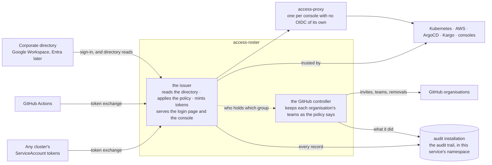

# access-roster

[](https://github.com/truvity/access-roster/actions/workflows/ci.yaml)
[](https://opensource.org/licenses/MIT)

**The policy is the product.** One file in git turns the groups your
people already have in the corporate directory, and the identities your
machines already hold — a GitHub Actions job, a Kubernetes ServiceAccount
— into one vocabulary of **internal groups**, gated per audience at one
small OpenID provider.

Everything that can read a claim gets that vocabulary **minted into a
token**: Kubernetes, AWS, ArgoCD, Kargo and every console behind your
gateway trust that one token, and so do CI jobs and workloads, from the
identity they already hold. Everything that cannot read a claim — GitHub
teams today — gets it **reconciled into a membership** instead, by a
controller reading the same file. A console shows you who holds what and
why, and an audit installation of its own, rendered beside it, keeps who
did what. A leaver disappears from the directory and, within a freshness
window, from everything downstream: authoritative or held, never guessed.

Nothing here authenticates anyone. Sign-in, passwords, MFA and device
policy stay with Google Workspace, and later Entra. This verifies the
result, knows the directory, and applies the policy — configured from a
Helm chart, with no database of record and no users of its own.

## What ships

Every artifact is stamped by one tag, `vX.Y.Z`; pin one version of this
repository.

| Artifact | Published at | For | |
|---|---|---|---|
| `access-issuer` chart and image | `oci://ghcr.io/truvity/charts/access-issuer`, `ghcr.io/truvity/access-roster/access-issuer` | the installation, once. One process: the directory, the policy, the OpenID provider, the login page, the console and the audit trail | shipped |
| `github-roster` image, in the same chart | `ghcr.io/truvity/access-roster/github-roster` | a second process: one loop that keeps every connected GitHub organisation's teams as the policy says, reporting to the console | shipped |
| `access-proxy` chart | removed in v1.32.0 | the chart was Envoy Gateway's external authorization backend; gateway-native OIDC replaces it there. For a gateway that is not Envoy Gateway, run upstream oauth2-proxy yourself — see [docs/design/access-proxy.md](docs/design/access-proxy.md), [ADR 0003](docs/decisions/0003-deprecate-access-proxy.md). Versions already published stay available. | removed |
| Go module | `github.com/truvity/access-roster` | services and consoles in Go: verify a bearer, read the caller's groups | shipped |
| TypeScript package | `@truvity/access-roster` on GitHub Packages | console UIs: `useIdentity()` over `/.access/whoami`; Node services: verify a bearer | shipped |
| `accessctl` | the release's archives, and a Nix flake on every release | people on laptops and CI jobs: one sign-in, then kubeconfigs, AWS credentials, a token for any audience, and short-lived certificates a secret manager mints | shipped |
| GitHub Action | `truvity/access-roster@<commit>` | workflows: one exchange, then a kubeconfig, AWS profiles, or a GitHub App token | shipped |
| the policy | one file, one schema | the issuer and the controller | shipped |
| an Entra directory backend | — | a second corporate directory, behind the same workspace record | planned |

## Who it is for

A platform team running Kubernetes, with the Gateway API, cert-manager,
and a corporate directory in Google Workspace, that wants one issuer for
its clusters, cloud accounts, consoles and CI instead of an identity
product. Envoy Gateway gets you gateway-native OIDC, the default now for a
console with no authorization model of its own. For a gateway that is not
Envoy Gateway, run upstream oauth2-proxy yourself (removed from this
repository in v1.32.0; see docs/design/access-proxy.md). A Valkey (for
more than one replica), an audit installation (for a trail that is a
record) and OpenBAO (for certificates) are optional. **None of those is
installed here**: the charts point at them. Nor is the signing key minted
here — cert-manager issues it, or the installation delivers it — and no
password, MFA or device policy lives here: sign-in stays with the
corporate directory.

### The niche

Every mature identity provider can do this. None of them is built for
it, and the difference is what you run to get it.

| | dex | Keycloak, Zitadel, Authentik | Okta, Auth0, Entra ID | Teleport | **access-roster** |
|---|---|---|---|---|---|
| runs on | a ConfigMap | a database, an operator, a login UI you theme | someone else's cloud | its own Auth and Proxy services, plus an agent per resource | a ConfigMap |
| users | none, federates | its own user store, plus federation | its own user store | its own local users, plus SSO connectors | none, federates |
| groups in the token | yes for Google Workspace, given a service account with domain-wide delegation; other IdPs only if they send them | after you write a mapper or a login hook per IdP | after you configure a sync | not a token: short-lived certificates carry roles an SSO connector mapped once, at login | read from the directory, always |
| several corporate IdPs, one issuer | yes | yes | yes | yes, several SSO connectors (OIDC, SAML, GitHub) | yes |
| one policy file for people **and** machines | no policy at all | no; roles per client, in the UI or the database | no; per-app assignments | no; roles are Teleport's own resources, separate from the SSO mapping | yes, in git — and GitHub teams in the same file |
| CI and workloads without a stored secret | token exchange (RFC 8693), but the client still needs a stored secret | machine users, with secrets | machine users, with secrets | yes — Machine ID's own join methods (cloud IAM, Kubernetes, CI OIDC) | token exchange from GitHub's or the cluster's own token |
| audience gating for cloud roles | no | via custom mappers | via app assignments | not verified | a `requires` list per client |
| who is in this group and why, at a glance | no | the admin UI, eventually | the admin UI | its own web UI | the directory console |
| operational footprint | tiny | large, and you own it | none, and you rent it | large: an Auth Service, a Proxy Service and an agent per resource | tiny |

dex comes closest to this shape: its Google connector reads Workspace
groups given a service account with domain-wide delegation, and it can
exchange a machine's own token for one of its own (RFC 8693). What it
does not have is a policy — no file mapping those groups to audiences, no
per-client gate, and no GitHub-teams reconciliation, so each of those is
a mapper, a hook or a sync written and run per relying party. The heavy
providers can be made to do all of it, at the cost of running an identity
product to use about a fifth of one. Teleport issues its own SSH,
database and Kubernetes certificates and runs its own access proxy in
front of your infrastructure; access-roster does not try to be that.
access-roster is dex's shape, with the directory read built in and one
policy file doing the rest: minted into tokens where a relying party can
read a claim, reconciled into memberships where it cannot.

### What you get

**As a person.** Sign in once, at one page, with your corporate account.
Every console behind the gateway opens without another login. One
`accessctl login` on your laptop, and `kubectl` works on every cluster
you are granted, AWS credentials come with no long-lived key, and a token
for any other audience is one command away. Link your GitHub account
once and the teams the policy puts you in follow. Sign out once: it ends
immediately at every client wired for Back-Channel Logout; for a
gateway-fronted console it ends within that token's own lifetime or
`ttl_cap`, since the gateway learns only at its next refresh; and an
application that minted its own session after signing in is reached only
through Back-Channel Logout, or whatever limit it put on that session
itself
([how each kind finds out](docs/design/access-roster.md#telling-the-relying-party-back-channel-logout)).

**As a machine.** A GitHub Actions job presents the identity token it
already has and receives one for AWS or a cluster, under a rule that
names the repository, the ref and, if you want, the repository's
visibility. The same `accessctl`, kubeconfig and AWS profile a person
uses on a laptop work unchanged inside the job. A workload in any
cluster does the same with its ServiceAccount token. No secret is stored
anywhere, and the rule sits in the same file as the human ones.

**As the operator.** One chart. The policy is values. The console shows
every person, every directory group, every internal group, every rule
that grants one, every open session, and every GitHub organisation with
what the controller would change and why. A leaver disappears from the
directory and, within the freshness window, from everything downstream,
GitHub teams included. Every sign-in, refusal, exchange, revoke and
console action is one record in an S3 bucket you own. What the console
adds at runtime lives in a handful of Secrets that a copy of restores.

## The model

The **directory** says who a person is and which directory groups they
are in. The **policy** maps directory groups, CI jobs and workloads into
**internal groups**, named `<scope>:<thing>:<role>`. A **client** is
everything that trusts the issuer — a cluster, a cloud role, a console —
and names the internal groups it `requires`; it is usually a row in the
policy, but a client the installation does not deploy may instead
describe itself by an allow-listed URL. A **resource** is what a token is
*for*, when that is not the client asking — a client names one (RFC
8707) and it becomes the token's audience, with its own `requires`. A
token is minted for a client or a resource, carries the internal groups,
and is refused before it exists when neither gate is satisfied.

### The shape



One chart, one Valkey, one bucket. A login makes no network call except
to the corporate directory — and, for a client that identifies itself by
a URL instead of a policy row, one bounded, cached HTTPS fetch of that
client's own document, from an allow-listed host only
([reference/policy.md](docs/reference/policy.md#clients-that-describe-themselves)).
An application that needs identity *inside* itself — per-user
authorization from `groups`, per-user audit, tokens of its own to call
something else, the way ArgoCD and Kargo do — signs in as its own client
of the issuer directly: **native OIDC**. A console with no authorization
model of its own, that only needs *may this person reach it at all*,
defaults instead to **gateway-native OIDC**: an Envoy Gateway
`SecurityPolicy` with `oidc:` against a declared client, gated by that
client's `requires`, with no OIDC code in the console
([which door](docs/decisions/0001-sessions-and-an-absolute-limit.md)).
`access-proxy` — upstream oauth2-proxy in a chart, and Envoy Gateway's
external authorization backend, so it works nowhere else — is
deprecated, with removal planned: gateway-native OIDC replaces it on
Envoy Gateway now. On any other gateway, run upstream oauth2-proxy
yourself, with a declared confidential client row of this issuer — a
documentation page for that is planned; it is not a chart of ours. Its
server-side session store was never a reason to prefer it either way —
oauth2-proxy encrypts each session with a key only the browser's cookie
holds, so nothing server-side, Back-Channel Logout included, can end one
([why](docs/design/access-proxy.md),
[ADR 0003](docs/decisions/0003-deprecate-access-proxy.md)). The GitHub
controller is a second process from the same chart, asking the issuer
who holds which group and acting on GitHub with an App the organisation's
owner created from the console.

### Many in, many out, one point in the middle

Every row is a guide of its own: follow it and add one more without
asking anyone.

| Fans in | Fans out |
|---|---|
| [corporate directories](docs/connect/corporate-directory.md): several Google Workspaces, Entra next — each a workspace with its own credential and its own served domains | [Kubernetes clusters, for people](docs/connect/kubernetes-cluster.md): each trusts the one issuer as its identity provider |
| [CI platforms](docs/connect/github-actions.md) — GitHub Actions today: one federated issuer, an owner allow-list | [AWS accounts](docs/connect/aws-account.md): each trusts the one issuer as an OIDC provider |
| [every cluster's own ServiceAccount tokens](docs/connect/service-to-service.md), for workloads: one row per cluster naming its key set | [GitHub organisations](docs/connect/github-organisation.md): one controller App each, bindings in the same policy, and a runner App per tier for self-hosted runners |
| | [consoles and applications](docs/connect/console-app.md): one client row each |

Adding one of anything is one row and one trust registration. The
issuer URL, the policy file and the console never multiply.

Everything in both columns is built and in use, with one exception: the
second directory backend (Entra) is designed behind the same workspace
record and not written yet.
[architecture.md](docs/architecture.md#fan-in-and-fan-out) says how each
row is expressed in configuration.

## Install and a worked example

```sh
helm install access-issuer oci://ghcr.io/truvity/charts/access-issuer \
  --version X.Y.Z --namespace access-issuer --create-namespace \
  --values issuer-values.yaml
```

```yaml
issuerURL: https://access.example.com      # stable for the life of the installation
# signingKey.certificate is left at its default: a P-384 key, so every token is ES384.
# A relying party that accepts only RS256 (Kargo; kube-apiserver flags left at their
# default) needs {algorithm: RSA, size: 2048, encoding: PKCS1} there instead.
route:
  host: access.example.com
  rootRedirect: /console/
  gatewayClassName: example-gateway-class
  certificate: { issuerName: example-ca, issuerKind: ClusterIssuer }
valkey:
  address: valkey.access-issuer.svc:6379
oauthClient:
  secret: { name: access-issuer-google-client }   # keys client-id and client-secret
console:
  client: access-console
policy:
  groups:
    all:access-roster:operator:
      members: [platform-admins@example.com]
      matchers:                                   # the first way in: recovery
        - service_account: { namespace: access-issuer, name: access-issuer-recovery }
    all:access-roster:viewer:
      matchers: [{ email_domain: example.com }]
  clients:
    access-console:
      kind: public
      redirects: [https://access.example.com/console/]
      requires: [all:access-roster:operator, all:access-roster:viewer]
```

Then sign in once with a recovery token
(`kubectl -n access-issuer create token access-issuer-recovery --audience access-issuer-recovery`),
and the console's Overview walks the rest: connecting the directory, and
the first operator who signs in as themselves.
[docs/operations/adoption-plain-helm.md](docs/operations/adoption-plain-helm.md)
is the whole walk-through, with the prerequisites and an `access-proxy`
beside it.

## Conformance

access-roster targets four OpenID Foundation profiles. A profile is
claimed only once the suite says so, so this is the last run rather than
an intention.

**Last run 2026-09-12 against the deployed issuer at v1.0.0**, from the
suite running in the cluster.

| Profile | Passed | Review | Skipped | Warning | **Failed** |
|---|--:|--:|--:|--:|--:|
| [Config OP](https://openid.net/certification/connect_op_testing/) | 1 | 0 | 0 | 0 | **0** |
| [Basic OP](https://openid.net/certification/connect_op_testing/) | 21 | 4 | 4 | 6 | **0** |
| [RP-Initiated Logout OP](https://openid.net/certification/connect_op_logout_testing/) | 3 | 8 | 0 | 0 | **0** |
| [Back-Channel Logout OP](https://openid.net/certification/connect_op_logout_testing/) | 2 | 0 | 0 | 0 | **0** |

The Foundation's rule is that only FAILED or INTERRUPTED disqualify a
profile. **REVIEW** is a screenshot the suite hands to a person; all
twelve were looked at on this run and each shows the page its step
demanded. **WARNING** is mostly personal data this issuer declines to
hold — a birthdate, a gender, a locale — with one real defect among
them found and fixed in v0.15.2. The logout pair the Foundation requires
for a submission, RP-Initiated plus Back-Channel, is green for the first
time; the first Back-Channel run found two defects, fixed in v0.17.1.
Every column, and why, is in
[docs/conformance.md](docs/conformance.md).

## Documentation

[docs/index.md](docs/index.md) is the one entry point: a map to every
page, organised by what you are trying to do. Three starting points from
there are worth naming here — [docs/adoption.md](docs/adoption.md) for
what taking this into use requires, [docs/safety.md](docs/safety.md) for
what is refused and why, and [CHANGELOG.md](CHANGELOG.md) for what
changed for a consumer, per version.

## The rule that makes this repository public

**Mechanism only.** Nothing here names an account, a zone, a hostname, a
cluster, an issuer or a secret path of any installation: every such thing
is a value with a neutral example, and the installation supplies it from
its own repository. Examples use `example.com`, `*.example` and the
`acme` and `globex` organisations. The rule covers code, docs, the
CHANGELOG, tests, commit messages and pull request text, because public
history cannot be unpublished. It is enforced mechanically:
[`hack/leak-canary.sh`](hack/leak-canary.sh), vendored from the shared
copy in `ci-workflows`, is a `just check` recipe and a CI job, and every
exception it carries is written down in the script with its reason.

This repository follows the shared
[component contract](https://github.com/truvity/ci-workflows/blob/master/docs/component-contract.md).

## Status

Used in production by its maintainers. [CHANGELOG.md](CHANGELOG.md) says
what exists at each version, and releases are on the
[releases page](https://github.com/truvity/access-roster/releases).

## Development

```sh
devbox shell        # or direnv: Go, buf, golangci-lint, helm, just, lefthook
just check          # build, test, lint, chart-lint, archive-check, docs-check, leak-canary, ts, vuln
just generate       # proto → gen/ after a contract change; the generated code is committed
```

[CONTRIBUTING.md](CONTRIBUTING.md) has the conventions and the console's
build order.

## Releasing

Push a tag `vX.Y.Z`: the release workflow publishes the images, both
charts, `accessctl` and its Nix flake, and the TypeScript package at that
version, and the Go module and the Action are the same tag. Auto-release
is present but not armed, so every release today is a manual tag; when
armed it cuts patches only, and minors and majors stay manual.

## Licence

MIT — see [LICENSE](LICENSE).
