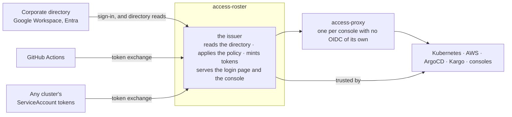

# access-roster

**One small OpenID provider for your infrastructure, configured from a
Helm chart, with no database and no users of its own.**

It reads the groups your people already have in the corporate directory
and puts them in a token. Kubernetes, AWS, ArgoCD, Kargo and every
console behind your gateway trust that one token. CI jobs and workloads
get the same treatment from the identity token they already hold. The
whole policy is one file in git, and a console shows you who holds what
and why.

Nothing here authenticates anyone. Sign-in, passwords, MFA and device
policy stay with Google Workspace or Entra. This verifies the result,
knows the directory, and applies the policy.

## The niche

Every mature identity provider can do this. None of them is built for
it, and the difference is what you run to get it.

| | dex | Keycloak, Zitadel, Authentik | Okta, Auth0, Entra ID | **access-roster** |
|---|---|---|---|---|
| runs on | a ConfigMap | a database, an operator, a login UI you theme | someone else's cloud | a ConfigMap |
| users | none, federates | its own user store, plus federation | its own user store | none, federates |
| groups in the token | only if the upstream IdP sends them — Google does not | after you write a mapper or a login hook per IdP | after you configure a sync | read from the directory, always |
| several corporate IdPs, one issuer | yes | yes | yes | yes |
| one policy file for people **and** machines | no policy at all | no; roles per client, in the UI or the database | no; per-app assignments | yes, in git — and GitHub teams in the same file |
| CI and workloads without a stored secret | connectors only for people | machine users, with secrets | machine users, with secrets | token exchange from GitHub's or the cluster's own token |
| audience gating for cloud roles | no | via custom mappers | via app assignments | a `requires` list per client |
| who is in this group and why, at a glance | no | the admin UI, eventually | the admin UI | the directory console |
| operational footprint | tiny | large, and you own it | none, and you rent it | tiny |

dex is the right shape and stops one step short: it has no idea what
groups anyone is in unless the upstream provider says, and Google never
says. The heavy providers can be made to do all of it, at the cost of
running an identity product to use about a fifth of one. access-roster
is dex with a directory reader and a policy file.

## What you get

**As a person.** Sign in once, at one page, with your corporate account.
Every console behind the gateway opens without another login. `kubectl`
works on every cluster you are granted, through kubelogin. `accessctl`
gives you AWS credentials for testing, ECR and the rest, with a browser
confirmation and no long-lived key. Sign out once and it ends everywhere.

**As a machine.** A GitHub Actions job presents the identity token it
already has and receives one for AWS or a cluster, under a rule that
names the repository and the ref. A workload in any cluster does the
same with its ServiceAccount token. No secret is stored anywhere, and
the rule sits in the same file as the human ones.

**As the operator.** One chart. The policy is values. The console shows
every person, every directory group, every internal group, every rule
that grants one, and every open session. A leaver disappears from the
directory and, within the freshness window, from everything downstream.

## Many in, many out, one point in the middle

| Fans in | Fans out |
|---|---|
| corporate directories: several Google Workspaces, Entra next — each a workspace with its own credential and its own served domains | Kubernetes clusters: each trusts the one issuer as its identity provider |
| GitHub Actions: one federated issuer, an owner allow-list | AWS accounts: each trusts the one issuer as an OIDC provider |
| every cluster's own ServiceAccount tokens: one row per cluster naming its key set | GitHub organisations: one controller App each, bindings in the same policy |
| | consoles and applications: one client row each |

Adding one of anything is one row and one trust registration. The
issuer URL, the policy file and the console never multiply.

Built today: **one service**, three Google Workspaces on one cluster,
four clients, workloads on any cluster proving themselves by that
cluster's published key set, a GitHub Action that needs nothing of ours
downloaded into a job, and `accessctl` for a laptop. Designed and
ticketed, not yet built: the second directory connector, and the GitHub
controller across organisations.
[architecture.md](docs/architecture.md#fan-in-and-fan-out) says which
is which, per row.

## The shape

One service and one Valkey. A login makes no network call except to the
corporate directory. The proxy is upstream oauth2-proxy in a chart, for
applications that cannot run an OpenID flow themselves; anything that can,
such as ArgoCD or Kargo, talks to the issuer directly.

> **Status.** Running on one cluster with three Google Workspaces
> connected and four relying parties on the issuer.
> [CHANGELOG.md](CHANGELOG.md) says what exists at each version, and the
> documents below describe what is built.

## Conformance

access-roster targets four OpenID Foundation profiles. A profile is
claimed only once the suite says so, so this is the last run rather than
an intention.

**Last run 2026-09-12 against the deployed issuer at v0.17.0.**

| Profile | Passed | Review | Skipped | Warning | **Failed** |
|---|--:|--:|--:|--:|--:|
| [Config OP](https://openid.net/certification/connect_op_testing/) | 1 | 0 | 0 | 0 | **0** |
| [Basic OP](https://openid.net/certification/connect_op_testing/) | 21 | 4 | 4 | 6 | **0** |
| [RP-Initiated Logout OP](https://openid.net/certification/connect_op_logout_testing/) | 3 | 8 | 0 | 0 | **0** |
| [Back-Channel Logout OP](https://openid.net/certification/connect_op_logout_testing/) | 1 | 0 | 0 | 0 | **0**† |

The Foundation's rule is that only FAILED or INTERRUPTED disqualify a
profile. **REVIEW** is a screenshot the suite hands to a person; all
twelve were looked at on this run and each shows the page its step
demanded. **WARNING** is mostly personal data this issuer declines to
hold — a birthdate, a gender, a locale — with one real defect among
them found and fixed in v0.15.2. †Back-Channel's end-to-end module needs
the issuer able to reach the suite, which a laptop suite and an
in-cluster issuer are not; the mechanism is proven in the issuer's own
log. Every column, and why, is in
[docs/conformance.md](docs/conformance.md).

## Read next

| You want to | Read |
|---|---|
| understand the ideas behind it | [docs/why.md](docs/why.md), then [docs/design/trust.md](docs/design/trust.md) |
| see every piece and how they connect | [docs/architecture.md](docs/architecture.md) |
| learn the ten words used precisely | [docs/concepts.md](docs/concepts.md) |
| write the policy | [docs/reference/policy.md](docs/reference/policy.md) |
| deploy it | [docs/reference/configuration.md](docs/reference/configuration.md), then [docs/operations/connect-runbook.md](docs/operations/connect-runbook.md) |
| put a console behind the gateway | [docs/connect/console-app.md](docs/connect/console-app.md) |
| connect a cluster, an AWS account, a GitHub organisation, ArgoCD, Kargo, a workflow | [docs/connect/](docs/connect/) |
| see what the conformance suite said, and why | [docs/conformance.md](docs/conformance.md) |
| run the conformance suite | [docs/operations/conformance.md](docs/operations/conformance.md) |
| build a service that accepts both people and workloads | [docs/connect/service-to-service.md](docs/connect/service-to-service.md) |

## What ships

| Artifact | For |
|---|---|
| `access-issuer` service and chart | the installation, once. One process: the directory, the policy, the OpenID provider, the login page and the console |
| `access-proxy` chart | every console with no OpenID flow of its own |
| Go module `github.com/truvity/access-roster` | services and consoles in Go: verify a bearer, read the caller's groups |
| TypeScript package `access-roster` | console UIs: `useIdentity()` over `/.access/whoami` |
| `accessctl` | people on laptops: kubeconfigs and AWS credentials |
| GitHub Action `truvity/access-roster@v1` | workflows: one exchange, then a kubeconfig and AWS profiles |
| the policy | one file, one schema, both services |

## Developing

`devbox shell` (or direnv), then `just check`. See
[CONTRIBUTING.md](CONTRIBUTING.md).

## License

[MIT](LICENSE).
