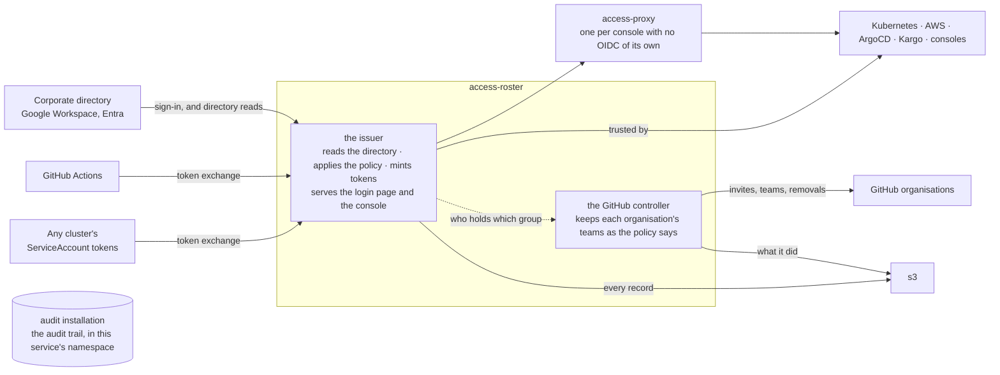

# access-roster

[](https://github.com/truvity/access-roster/actions/workflows/ci.yaml)
[](https://opensource.org/licenses/MIT)

**One small OpenID provider for your infrastructure, configured from a
Helm chart, with no database and no users of its own.**

It reads the groups your people already have in the corporate directory
and puts them in a token. Kubernetes, AWS, ArgoCD, Kargo and every
console behind your gateway trust that one token. CI jobs and workloads
get the same treatment from the identity token they already hold. The
whole policy is one file in git; the same file says who belongs in which
GitHub team, and a controller keeps the teams that way. A console shows
you who holds what and why, and an audit installation of its own, rendered
beside it, keeps who did what.

Nothing here authenticates anyone. Sign-in, passwords, MFA and device
policy stay with Google Workspace or Entra. This verifies the result,
knows the directory, and applies the policy.

## What ships

Every artifact is stamped by one tag, `vX.Y.Z`; pin one version of this
repository.

| Artifact | Published at | For | |
|---|---|---|---|
| `access-issuer` chart and image | `oci://ghcr.io/truvity/charts/access-issuer`, `ghcr.io/truvity/access-roster/access-issuer` | the installation, once. One process: the directory, the policy, the OpenID provider, the login page, the console and the audit trail | shipped |
| `github-roster` image, in the same chart | `ghcr.io/truvity/access-roster/github-roster` | a second process: one loop that keeps every connected GitHub organisation's teams as the policy says, reporting to the console | shipped |
| `access-proxy` chart | `oci://ghcr.io/truvity/charts/access-proxy` | every console with no OpenID flow of its own | shipped |
| Go module | `github.com/truvity/access-roster` | services and consoles in Go: verify a bearer, read the caller's groups | shipped |
| TypeScript package | `@truvity/access-roster` on GitHub Packages | console UIs: `useIdentity()` over `/.access/whoami`; Node services: verify a bearer | shipped |
| `accessctl` | the release's archives, and a Nix flake on every release | people on laptops and CI jobs: one sign-in, then kubeconfigs, AWS credentials, a token for any audience, and short-lived certificates a secret manager mints | shipped |
| GitHub Action | `truvity/access-roster@<commit>` | workflows: one exchange, then a kubeconfig, AWS profiles, or a GitHub App token | shipped |
| the policy | one file, one schema | the issuer and the controller | shipped |
| an Entra directory backend | — | a second corporate directory, behind the same workspace record | planned |

## Who it is for

A platform team running Kubernetes, with the Gateway API, cert-manager,
and a corporate directory in Google Workspace, that wants one issuer for
its clusters, cloud accounts, consoles and CI instead of an identity
product. `access-proxy` needs Envoy Gateway. A Valkey (for more than one
replica and for every proxy), an audit installation (for a trail that is a
record) and OpenBAO (for certificates) are optional. **None of those is
installed here**: the charts point at them. Nor is the signing key minted
here — cert-manager issues it, or the installation delivers it — and no
password, MFA or device policy lives here: sign-in stays with the
corporate directory.

### The niche

Every mature identity provider can do this. None of them is built for
it, and the difference is what you run to get it.

| | dex | Keycloak, Zitadel, Authentik | Okta, Auth0, Entra ID | **access-roster** |
|---|---|---|---|---|
| runs on | a ConfigMap | a database, an operator, a login UI you theme | someone else's cloud | a ConfigMap |
| users | none, federates | its own user store, plus federation | its own user store | none, federates |
| groups in the token | only if the upstream IdP sends them — Google does not | after you write a mapper or a login hook per IdP | after you configure a sync | read from the directory, always |
| several corporate IdPs, one issuer | yes | yes | yes | yes |
| one policy file for people **and** machines | no policy at all | no; roles per client, in the UI or the database | no; per-app assignments | yes, in git — and GitHub teams in the same file |
| CI and workloads without a stored secret | connectors only for people | machine users, with secrets | machine users, with secrets | token exchange from GitHub's or the cluster's own token |
| audience gating for cloud roles | no | via custom mappers | via app assignments | a `requires` list per client |
| who is in this group and why, at a glance | no | the admin UI, eventually | the admin UI | the directory console |
| operational footprint | tiny | large, and you own it | none, and you rent it | tiny |

dex is the right shape and stops one step short: it has no idea what
groups anyone is in unless the upstream provider says, and Google never
says. The heavy providers can be made to do all of it, at the cost of
running an identity product to use about a fifth of one. access-roster
is dex with a directory reader and a policy file.

### What you get

**As a person.** Sign in once, at one page, with your corporate account.
Every console behind the gateway opens without another login. One
`accessctl login` on your laptop, and `kubectl` works on every cluster
you are granted, AWS credentials come with no long-lived key, and a token
for any other audience is one command away. Link your GitHub account
once and the teams the policy puts you in follow. Sign out once and it
ends everywhere.

**As a machine.** A GitHub Actions job presents the identity token it
already has and receives one for AWS or a cluster, under a rule that
names the repository, the ref and, if you want, the repository's
visibility. The same `accessctl`, kubeconfig and AWS profile a person
uses on a laptop work unchanged inside the job. A workload in any
cluster does the same with its ServiceAccount token. No secret is stored
anywhere, and the rule sits in the same file as the human ones.

**As the operator.** One chart. The policy is values. The console shows
every person, every directory group, every internal group, every rule
that grants one, every open session, and every GitHub organisation with
what the controller would change and why. A leaver disappears from the
directory and, within the freshness window, from everything downstream,
GitHub teams included. Every sign-in, refusal, exchange, revoke and
console action is one record in an S3 bucket you own. What the console
adds at runtime lives in a handful of Secrets that a copy of restores.

## The model

Four nouns. The **directory** says who a person is and which directory
groups they are in. The **policy** maps directory groups, CI jobs and
workloads into **internal groups**, named `<scope>:<thing>:<role>`. A
**client** is everything that trusts the issuer — a cluster, a cloud
role, a console — and names the internal groups it `requires`. A token
is minted for one client, carries the internal groups, and is refused
before it exists when none of them is required.

### The shape



One chart, one Valkey, one bucket. A login makes no network call except
to the corporate directory. The proxy is upstream oauth2-proxy in a chart,
for applications that cannot run an OpenID flow themselves; anything that
can, such as ArgoCD or Kargo, talks to the issuer directly. The GitHub
controller is a second process from the same chart, asking the issuer
who holds which group and acting on GitHub with an App the organisation's
owner created from the console.

### Many in, many out, one point in the middle

Every row is a guide of its own: follow it and add one more without
asking anyone.

| Fans in | Fans out |
|---|---|
| [corporate directories](docs/connect/corporate-directory.md): several Google Workspaces, Entra next — each a workspace with its own credential and its own served domains | [Kubernetes clusters, for people](docs/connect/kubernetes-cluster.md): each trusts the one issuer as its identity provider |
| [CI platforms](docs/connect/github-actions.md) — GitHub Actions today: one federated issuer, an owner allow-list | [AWS accounts](docs/connect/aws-account.md): each trusts the one issuer as an OIDC provider |
| [every cluster's own ServiceAccount tokens](docs/connect/service-to-service.md), for workloads: one row per cluster naming its key set | [GitHub organisations](docs/connect/github-organisation.md): one controller App each, bindings in the same policy, and a runner App per tier for self-hosted runners |
| | [consoles and applications](docs/connect/console-app.md): one client row each |

Adding one of anything is one row and one trust registration. The
issuer URL, the policy file and the console never multiply.

Everything in both columns is built and in use, with one exception: the
second directory backend (Entra) is designed behind the same workspace
record and not written yet.
[architecture.md](docs/architecture.md#fan-in-and-fan-out) says how each
row is expressed in configuration.

## Install and a worked example

```sh
helm install access-issuer oci://ghcr.io/truvity/charts/access-issuer \
  --version X.Y.Z --namespace access-issuer --create-namespace \
  --values issuer-values.yaml
```

```yaml
issuerURL: https://access.example.com      # stable for the life of the installation
route:
  host: access.example.com
  rootRedirect: /console/
  gatewayClassName: example-gateway-class
  certificate: { issuerName: example-ca, issuerKind: ClusterIssuer }
valkey:
  address: valkey.access-issuer.svc:6379
oauthClient:
  secret: { name: access-issuer-google-client }   # keys client-id and client-secret
console:
  client: access-console
policy:
  groups:
    all:access-roster:operator:
      members: [platform-admins@example.com]
      matchers:                                   # the first way in: recovery
        - service_account: { namespace: access-issuer, name: access-issuer-recovery }
    all:access-roster:viewer:
      matchers: [{ email_domain: example.com }]
  clients:
    access-console:
      kind: public
      redirects: [https://access.example.com/console/]
      requires: [all:access-roster:operator, all:access-roster:viewer]
```

Then sign in once with a recovery token
(`kubectl -n access-issuer create token access-issuer-recovery --audience access-issuer-recovery`),
and the console's Overview walks the rest: connecting the directory, and
the first operator who signs in as themselves.
[docs/operations/adoption-plain-helm.md](docs/operations/adoption-plain-helm.md)
is the whole walk-through, with the prerequisites and an `access-proxy`
beside it.

## Conformance

access-roster targets four OpenID Foundation profiles. A profile is
claimed only once the suite says so, so this is the last run rather than
an intention.

**Last run 2026-09-12 against the deployed issuer at v1.0.0**, from the
suite running in the cluster.

| Profile | Passed | Review | Skipped | Warning | **Failed** |
|---|--:|--:|--:|--:|--:|
| [Config OP](https://openid.net/certification/connect_op_testing/) | 1 | 0 | 0 | 0 | **0** |
| [Basic OP](https://openid.net/certification/connect_op_testing/) | 21 | 4 | 4 | 6 | **0** |
| [RP-Initiated Logout OP](https://openid.net/certification/connect_op_logout_testing/) | 3 | 8 | 0 | 0 | **0** |
| [Back-Channel Logout OP](https://openid.net/certification/connect_op_logout_testing/) | 2 | 0 | 0 | 0 | **0** |

The Foundation's rule is that only FAILED or INTERRUPTED disqualify a
profile. **REVIEW** is a screenshot the suite hands to a person; all
twelve were looked at on this run and each shows the page its step
demanded. **WARNING** is mostly personal data this issuer declines to
hold — a birthdate, a gender, a locale — with one real defect among
them found and fixed in v0.15.2. The logout pair the Foundation requires
for a submission, RP-Initiated plus Back-Channel, is green for the first
time; the first Back-Channel run found two defects, fixed in v0.17.1.
Every column, and why, is in
[docs/conformance.md](docs/conformance.md).

## Documentation

- [docs/adoption.md](docs/adoption.md) — prerequisites, install order,
  connecting things, migrating, and the zero-diff gate
- [docs/safety.md](docs/safety.md) — what is refused and why, the
  failure semantics, and the traps
- [docs/reference.md](docs/reference.md) — every value, flag, input and
  output
- [docs/doctrine.md](docs/doctrine.md) — the design rules, and who owns
  what
- [CHANGELOG.md](CHANGELOG.md) — what changed for a consumer, per version

### Read next

| You want to | Read |
|---|---|
| understand the ideas behind it | [docs/why.md](docs/why.md), then [docs/design/trust.md](docs/design/trust.md) |
| see every piece and how they connect | [docs/architecture.md](docs/architecture.md) |
| learn the ten words used precisely | [docs/concepts.md](docs/concepts.md) |
| write the policy | [docs/reference/policy.md](docs/reference/policy.md) |
| connect the corporate directory people sign in with | [docs/connect/corporate-directory.md](docs/connect/corporate-directory.md), and [docs/operations/connect-runbook.md](docs/operations/connect-runbook.md) |
| give a CI job an identity with no stored secret | [docs/connect/github-actions.md](docs/connect/github-actions.md) |
| deploy it | [docs/operations/adoption-plain-helm.md](docs/operations/adoption-plain-helm.md), [docs/reference/configuration.md](docs/reference/configuration.md), then [docs/operations/connect-runbook.md](docs/operations/connect-runbook.md) |
| run it: what to check, what to back up, how to restore | [docs/operations/runbook.md](docs/operations/runbook.md), [configuration.md — restoring from the Secrets alone](docs/reference/configuration.md#restoring-from-the-secrets-alone) |
| use it from a laptop or a CI job | [docs/reference/accessctl.md](docs/reference/accessctl.md) |
| put a console behind the gateway | [docs/connect/console-app.md](docs/connect/console-app.md) |
| keep a GitHub organisation's teams in step with the policy | [docs/connect/github-organisation.md](docs/connect/github-organisation.md) |
| declare GitHub Apps as data and create them from the console | [docs/connect/github-apps-catalogue.md](docs/connect/github-apps-catalogue.md) |
| give a Pulumi or Terraform program that manages the organisation an identity of its own | [docs/connect/infrastructure-as-code.md](docs/connect/infrastructure-as-code.md) |
| connect a cluster, an AWS account, ArgoCD, Kargo, a workflow | [docs/connect/](docs/connect/) |
| mint a short-lived SSH, database or client certificate | [docs/connect/openbao.md](docs/connect/openbao.md) |
| fetch the values a team shares while it develops into a `.env` file | [docs/connect/openbao.md](docs/connect/openbao.md#and-holds-a-teams-secrets) |
| see a secret store's namespaces, groups and who reaches what — read-only | [docs/connect/openbao.md](docs/connect/openbao.md#console-side) |
| see what the conformance suite said, and why | [docs/conformance.md](docs/conformance.md) |
| run the conformance suite | [docs/operations/conformance.md](docs/operations/conformance.md) |
| build a service that accepts both people and workloads | [docs/connect/service-to-service.md](docs/connect/service-to-service.md) |

## The rule that makes this repository public

**Mechanism only.** Nothing here names an account, a zone, a hostname, a
cluster, an issuer or a secret path of any installation: every such thing
is a value with a neutral example, and the installation supplies it from
its own repository. Examples use `example.com`, `*.example` and the
`acme` and `globex` organisations. The rule covers code, docs, the
CHANGELOG, tests, commit messages and pull request text, because public
history cannot be unpublished. It is enforced mechanically:
[`hack/leak-canary.sh`](hack/leak-canary.sh), vendored from the shared
copy in `ci-workflows`, is a `just check` recipe and a CI job, and every
exception it carries is written down in the script with its reason.

This repository follows the shared
[component contract](https://github.com/truvity/ci-workflows/blob/master/docs/component-contract.md).

## Status

Used in production by its maintainers. [CHANGELOG.md](CHANGELOG.md) says
what exists at each version, and releases are on the
[releases page](https://github.com/truvity/access-roster/releases).

## Development

```sh
devbox shell        # or direnv: Go, buf, golangci-lint, helm, just, lefthook
just check          # build, test, lint, chart-lint, archive-check, docs-check, leak-canary, ts, vuln
just generate       # proto → gen/ after a contract change; the generated code is committed
```

[CONTRIBUTING.md](CONTRIBUTING.md) has the conventions and the console's
build order.

## Releasing

Push a tag `vX.Y.Z`: the release workflow publishes the images, both
charts, `accessctl` and its Nix flake, and the TypeScript package at that
version, and the Go module and the Action are the same tag. Auto-release
is present but not armed, so every release today is a manual tag; when
armed it cuts patches only, and minors and majors stay manual.

## Licence

MIT — see [LICENSE](LICENSE).
