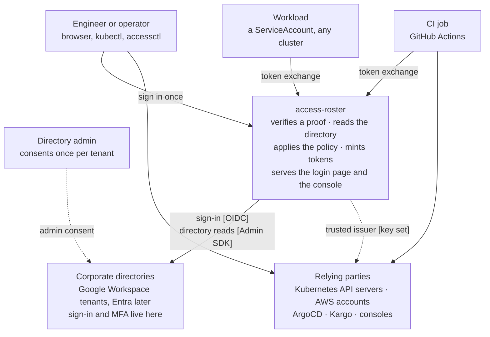
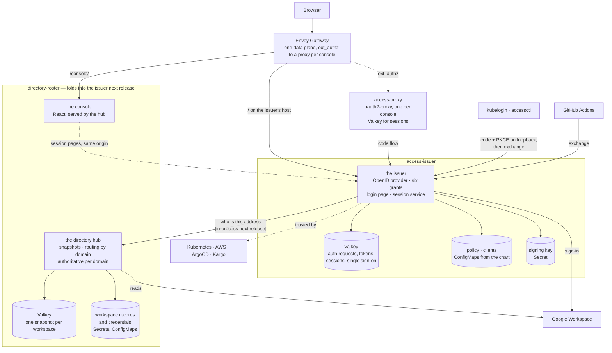

# Architecture

Every container, what it holds, and why the pieces are arranged this way.
Decisions and their reasons are in the design documents
([trust](design/trust.md), [issuer](design/access-issuer.md),
[hub](design/hub.md), [proxy](design/access-proxy.md)); contracts are
under [reference/](reference/). Diagrams follow the C4 model as Mermaid,
which GitHub renders inline.

> **Two services today, one next release.** The repository ships the
> issuer and the directory hub as separate deployments, and that is what
> this page draws. They fold into one process next release, and where it
> matters the page says so. The model, the policy, the token and the
> console do not change.

## The rule under everything

Every arrow in this document rests on one of exactly two roots of trust,
and which one is decided by how far away the caller is, never by
preference. [design/trust.md](design/trust.md) is the argument; this is
the summary.

| Anchor | Proves | Used for |
|---|---|---|
| **the issuer** — its signing key, published as a key set | an identity the policy has resolved to internal groups | everything: people, CI, workloads, every relying party |
| **the cluster** — a ServiceAccount token the API server checks | a workload running *here* | recovery alone: the way in on the day the directory is broken, which should depend on nothing else |

Whichever anchor proved a caller, what a service acts on is one thing: a
flat list of **internal group names**, the `groups` claim, never
re-mapped. There is no third anchor and no second vocabulary.

## Context

Nothing in access-roster has a database. Nothing authenticates anyone.
The directories hold the people; the relying parties hold their own
roles; access-roster holds the policy, a snapshot of the directory, and
the sessions it has open.

## Containers

**One hostname.** The issuer holds the root of it: the issuer URL is the
`iss` claim in every token, and discovery must sit at
`/.well-known/openid-configuration` at an origin root. The console is
mounted under `/console/`, same-origin with the issuer, so its session
pages call the issuer with the browser's own cookie and no bearer in
JavaScript.

**What each store holds, and what losing it costs.**

| Store | Holds | Lost means |
|---|---|---|
| the issuer's Valkey | auth requests, tokens, per-client sessions, the single sign-on record | everyone signs in again |
| the directory's Valkey | one snapshot per workspace | a refresh, and a hold window with provisional answers |
| the proxies' Valkey | browser sessions of every proxied console | one silent redirect per console; the issuer still knows the person |
| ConfigMaps and Secrets | the policy, the clients, directory credentials, the signing key | git, and the connect runbook |

They collapse into one Valkey with the merge.

## Fan-in and fan-out

One issuer in the middle. Everything to its left is a source of
identity; everything to its right trusts it. Each row says how it is
expressed in configuration and whether it is built.

| Many of | Expressed as | Status |
|---|---|---|
| corporate directories | one workspace per tenant: credential, served domains, synced groups; Google today, Entra as a second backend behind the same workspace record | **built**, three Workspaces live; Entra designed, not built |
| clusters, for people | each cluster's identity-provider association names the issuer; RBAC binds `<env>:k8s:<role>` | designed (INF-652); bindings dual-bound and ready |
| clusters, for workloads | one row per cluster naming its ServiceAccount-token key set; token exchange | **built** (INF-692). The issuer's own cluster is a row like any other, and the issuer holds access to none of them |
| AWS accounts | the issuer registered once per account as an IAM OIDC provider; a `requires` list per role client | designed (INF-653) |
| GitHub organisations | one controller App per org; `github team` rules in the policy; links in a ConfigMap the controller maintains | designed (INF-696, INF-697) |
| CI platforms | one federated issuer row; `ci` rules on repository and ref | verifier built; the action designed (INF-654) |
| consoles and applications | one client row each; a proxy for those with no OpenID flow of their own | **built**: the directory console, hubble, Kargo |

What never multiplies: the issuer URL, the signing key, the policy file,
the console, the login page.

## The six grants

The issuer serves these and nothing else. Each exists for one of three
needs: a browser reaching a web UI, a CLI on a laptop with a browser to
confirm in, and a machine that already holds a token.

| Grant | For |
|---|---|
| authorization code + PKCE | every browser flow, and every CLI: kubelogin and `accessctl` open a browser and listen on a loopback port |
| refresh | sessions that outlive a token |
| userinfo | relying parties that ask |
| `end_session` | sign-out ends the sign-in, not one application's cookie |
| revocation | "sign out everywhere", and the operator's revoke |
| **token exchange** | the one machine grant, and the CLI's re-audiencing for AWS |

Token exchange takes three kinds of subject, all verified the same way,
against a key set the issuer trusts and holding no credential for:

| Subject | Verified against | Rule kind |
|---|---|---|
| a GitHub Actions token | GitHub's key set, an owner allow-list | CI job: repository and ref |
| a ServiceAccount token from any cluster | that cluster's key set | workload: cluster, namespace, name |
| a person's own issuer token | our own key set | none needed: re-audiencing for AWS or a cluster |

That is what makes one issuer serve many clusters cheaply: a new cluster
is one row naming its key set, not a credential held anywhere. Device
flow, client credentials and JWT bearer were served through 0.11 and are
gone; introspection never applied, because these are JWTs verified
offline ([why](reference/access-issuer.md#endpoints)).

Three of the six are grants and three are endpoints, so
`grant_types_supported` prints three: `authorization_code`,
`refresh_token` and token exchange. Userinfo, `end_session` and
revocation are advertised in fields of their own. They are counted
together because they answer one question — what does this issuer serve
— and listing an endpoint as a grant type would be the metadata lying in
a new way.

## Where each decision is made

Three layers, and none is the fallback for another.

- **The issuer decides who may hold a token.** Every client names the
  internal groups an identity must hold before a token is minted for it.
  An empty list means nobody, and the issuer refuses to start on one.
- **The proxy decides whether a browser is signed in.** Nothing more.
  It runs the code flow, holds the session, forwards the token.
- **The application decides what the token opens.** From its own
  tables, or from the `groups` claim. hubble has no roles at all, which
  is exactly why its check sits at the issuer.

## Who owns what

| | access-roster | the directories | the relying parties |
|---|---|---|---|
| holds | the policy, a directory snapshot, open sessions, one signing key, the directories' read credentials | the people: passwords, MFA, devices, groups | their own roles |
| decides | who may hold a token for which client, and what groups it carries | who exists and who is in which group | what a group opens |
| authenticates | nobody | everybody | nobody; they verify |
| when down | no new sign-ins; sessions and tokens live to expiry; recovery by cluster proof | last snapshot stands for the hold window, then answers are provisional | unaffected by the others |

## Use cases, in one line each

| A person… | What happens |
|---|---|
| opens a console for the first time | the proxy sends the browser to the issuer, the issuer to Google, Google back; the issuer asks the directory who this is, checks the client's `requires`, mints; the proxy sets its cookie |
| opens a second console | the proxy sends the browser to the issuer; the issuer recognises its own session and completes silently |
| runs `kubectl` | kubelogin does code + PKCE on a loopback port; the cluster trusts the issuer and reads `groups` |
| needs AWS credentials | `accessctl` exchanges the token it holds for one audienced at AWS; STS trusts the issuer |
| signs out | the proxy clears its cookie and calls `end_session`; every other console asks again on its next visit |
| leaves the company | the next snapshot no longer lists them; within the freshness window, the next refresh anywhere is refused |

| A machine… | What happens |
|---|---|
| is a GitHub Actions job | presents GitHub's token; a CI rule names its repository and ref; the exchange returns a token for AWS or a cluster |
| is a workload in a cluster | presents its ServiceAccount token; a workload rule names it; same exchange |
| is the recovery path | a person mints a short-lived ServiceAccount token proving cluster access; a workload rule puts that subject in the operator group; it works when the directory does not |

## Failure semantics

| Situation | What consumers and operators see |
|---|---|
| Probe failed, snapshot still young | answers from the snapshot, `authoritative=false` |
| Snapshot older than the freshness window | same |
| Full refresh failed a page | old snapshot kept; nothing partial is ever served |
| Domain claimed by two workspaces | `authoritative=false` for that domain on both |
| Address in no served domain | `in_domain=false`: no opinion |
| Account missing from the snapshot | one live read first; `found=false` only after the backend said so |
| Valkey unreachable | every domain non-authoritative until it returns |
| Credential revoked or admin suspended | probe fails → provisional; reconnect is the recovery |
| A request would wait on the directory | it does not: the work runs detached and the answer is *first snapshot pending* |
| A signed-in operator's own account turns non-authoritative | last granted role kept for a bounded window; nothing new granted |
| A policy the issuer refuses to load | the new pod does not start and the previous pods keep serving the previous policy; nothing visible changes except the new clients are absent |
| access-roster is down | no new sign-ins anywhere; existing sessions and tokens live to expiry; recovery is by cluster proof |

The rule under all of them: **access is removed only on an authoritative
answer.** Everything that can go wrong degrades to *provisional*, never
to "gone". The one exception is the last-but-one row, which is why the
render is being taught to validate its own output.
