# Architecture

One page for the whole family: the directory hub, the issuer that comes
after it, the proxy, the libraries and the CLI around them, the relying
parties, and the flows that have to work. Decisions and their reasons
live in the design documents ([hub](design/hub.md),
[issuer](design/access-issuer.md), [proxy](design/access-proxy.md),
[libraries](design/libraries.md), [CLI](design/accessctl.md)); the
contracts in [reference/](reference/). Diagrams
follow the C4 model and are drawn as Mermaid flowcharts, which GitHub
renders inline.

## How operators reach the hub — read this first

The hub's console is reached **the same way as every other console in
the installation: through the authenticating proxy that fronts them
all** — `access-proxy` — which forwards the caller's token from the
installation's issuer (access-issuer once it exists; whatever identity
provider the installation runs until then). The hub verifies that bearer and applies
its policy. That is the normal path, and it is the only path drawn
solid below.

The hub also carries its **own login page**, for exactly two situations:

- a **standalone installation** with no proxy and no issuer, where
  operators sign in with the connected directory itself;
- **recovery**, a short-lived token proving cluster access (a generated
  password outside Kubernetes), reached by port-forward,
  for day one and for the day the proxy or the issuer is what is broken.

It is drawn dotted, once, and it is never a third parallel path in an
installation that has a proxy.

**One hostname for the family's own console and its issuer** (decided
2026-09-10, [design/access-issuer.md](design/access-issuer.md) *One
origin*). The issuer sits at the **root** of the domain — its URL is the
`iss` claim in every token and discovery lives at the origin root, so it
cannot take a path — and the hub's console is mounted **under a path**,
`/console/`, with the gateway rewriting the prefix away. The two are
therefore same-origin, which is what lets the console's session pages
call the issuer with the browser's own session cookie and no bearer. The
hub's **API listener is never on that hostname**: it is the cluster
anchor, reached by Service DNS, with no route. Every other console in the
installation keeps its own hostname; this is one pair sharing one.

## Two trust anchors — the rule under every arrow

Every solid arrow below rests on one of exactly two roots of trust, and
which one is decided by **scope**, never by preference
([design/trust.md](design/trust.md)):

| Anchor | Proves | Used by |
|---|---|---|
| **the cluster** — a ServiceAccount token, checked by TokenReview, bound to an audience | a workload running *here* | a workload calling a service in the same cluster: the issuer → the hub, github-roster → the hub; and break-glass, deliberately, as the floor |
| **the issuer** — access-issuer's signing key, published as JWKS | an identity the policy has resolved to internal groups | everything further away: people, CI, another cluster, a laptop, every relying party |

The issuer is *built on* the cluster (its workload verifier turns a
ServiceAccount token into an issuer token), so accepting both is one
layering seen from two heights, not two authorities. A service with a
console and an API has **two listeners, one anchor each** — the hub is
the pattern — and whichever anchor proved a caller, what the service acts
on is the same thing: a flat list of **internal group names**, the
`groups` claim, never re-mapped. There is no third anchor and no second
vocabulary.

## 1. Context

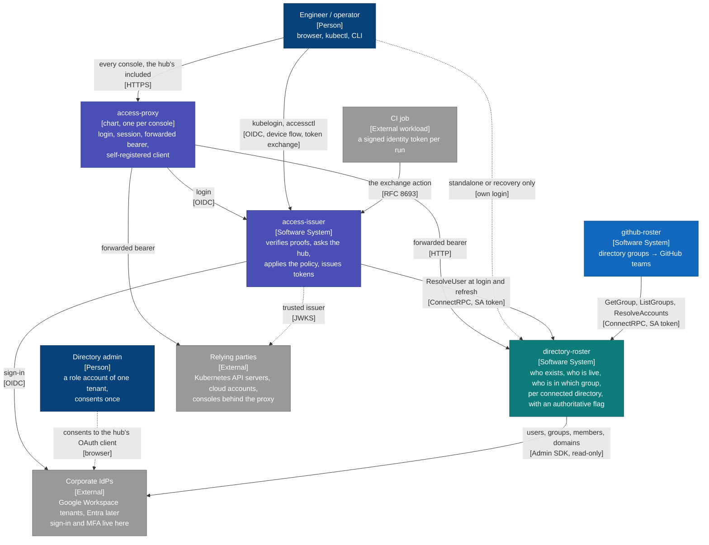

The hub sits behind exactly two callers, access-issuer and github-roster,
plus its own console. Applications read the forwarded bearer through the
Go module or the TypeScript package; they implement no login. Everything else reads claims from the
access-issuer and never sees the hub. Neither component has a database;
neither authenticates anyone.

## 2. Containers

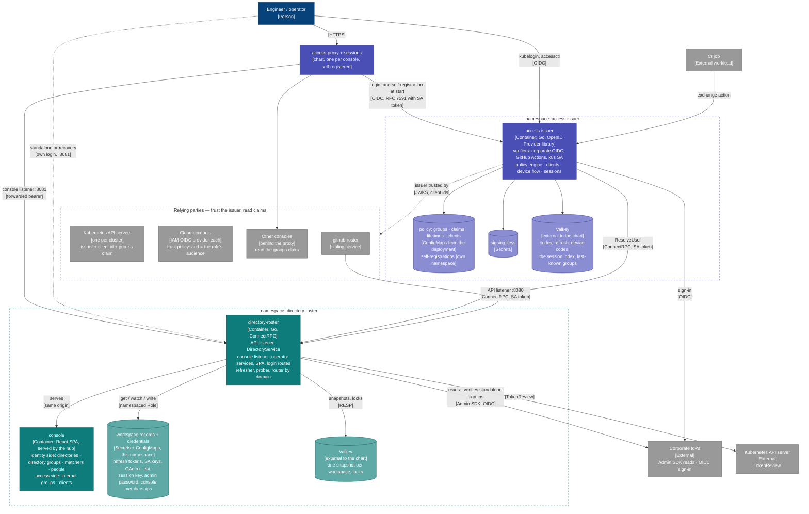

The two hub listeners are the privilege boundary, and they are the two
anchors made physical. The API listener admits only allow-listed
ServiceAccount tokens, verified by TokenReview — the cluster anchor — and
carries DirectoryService alone; when it admits remote callers too, it
verifies their issuer tokens on the same port and keys the grant by the
principal. The console listener carries the operator services and the
SPA behind the hub's session, minted from the forwarded bearer — the
issuer anchor — on the first request or, standalone, by the hub's own
login. NetworkPolicy enforces both as the second layer, never the only
one.

## 3. Components of the hub

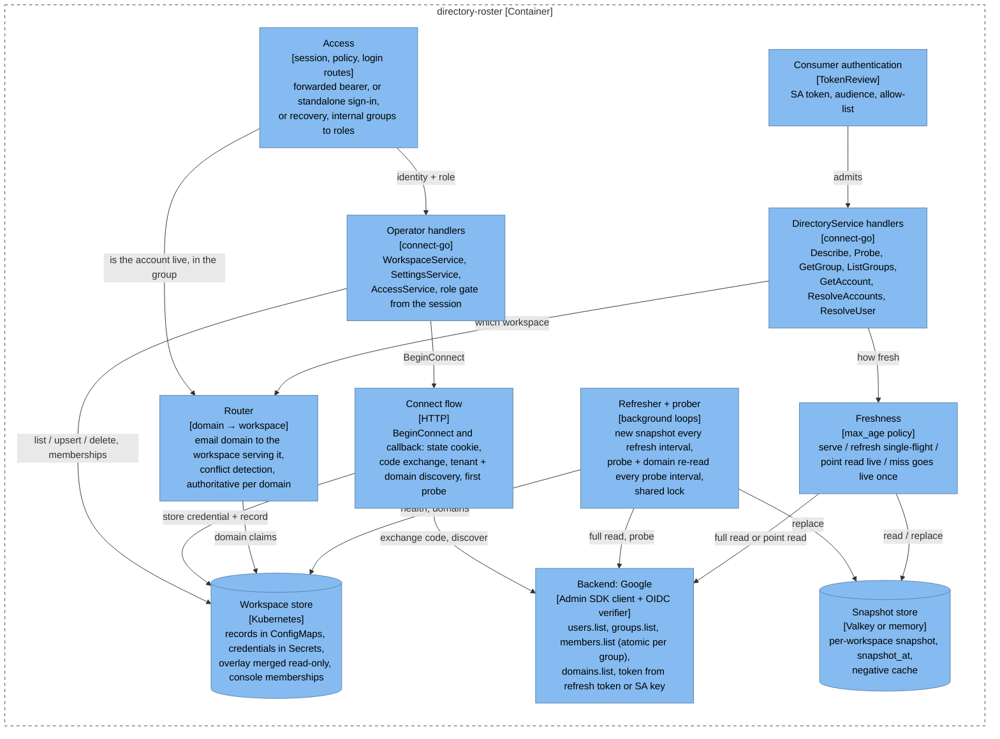

## 4. Who owns what

| | directory-roster | access-issuer | external |
|---|---|---|---|
| credentials held | directory read credentials — the only place they exist | its own signing keys | the IdPs hold users, passwords, MFA |
| knows | who exists, who is live, who is in which group, which domains each tenant owns, and whether that is authoritative | who just proved what | each relying party knows its own roles |
| decides | nothing about access; it answers | what a proof entitles you to | each relying party enforces on claims |
| authenticates | nobody | nobody | Google, Entra, the CI platform |
| issues | nothing | tokens to registered clients and exchanged tokens for workloads | the cloud issues credentials against the audience |
| operator surface | two mirrored sides, identity and access: a page per directory, directory group, person, internal group and client, search over all of them | one read-only page | the proxy, unchanged |
| when down | the issuer keeps last-known groups within a window; github-roster holds removals | no new logins; sessions live to expiry; break-glass is outside | |

## 5. Use cases

### 5.1 An operator opens a console — the hub's console included

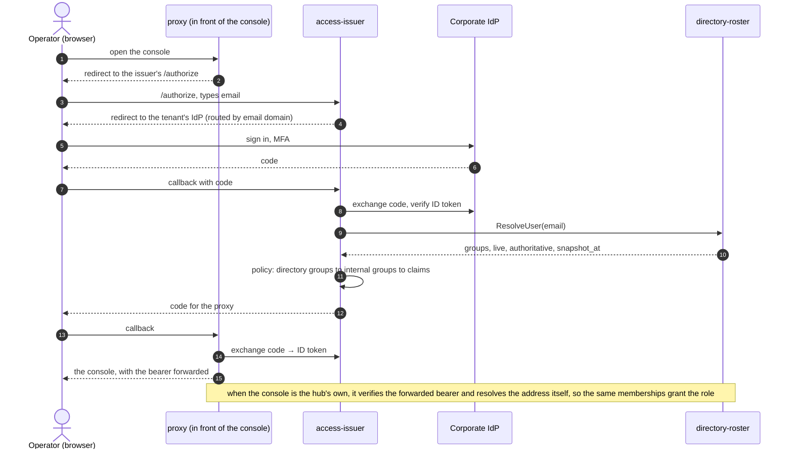

In an installation that has not yet moved to access-issuer, the issuer
in this flow is whatever identity provider it already runs; nothing
about the hub's side changes.

### 5.2 kubectl on a cluster

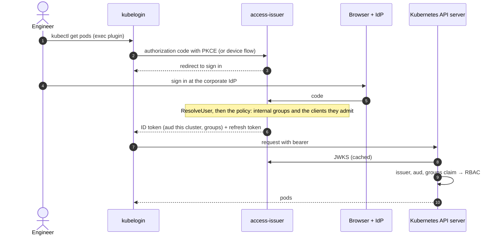

### 5.3 Cloud credentials without a directory service on the cloud side

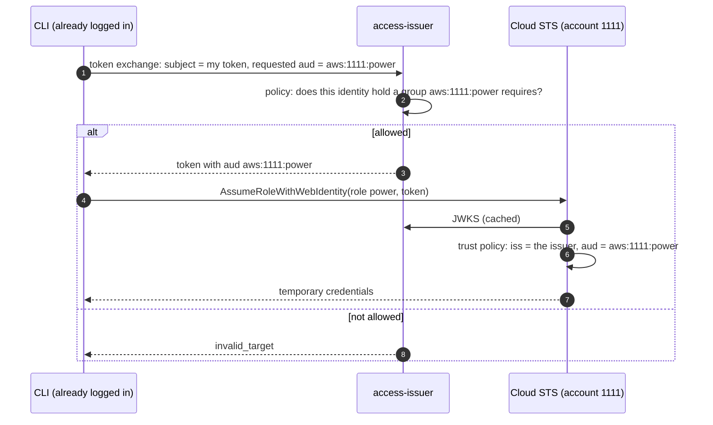

### 5.4 A CI job deploys

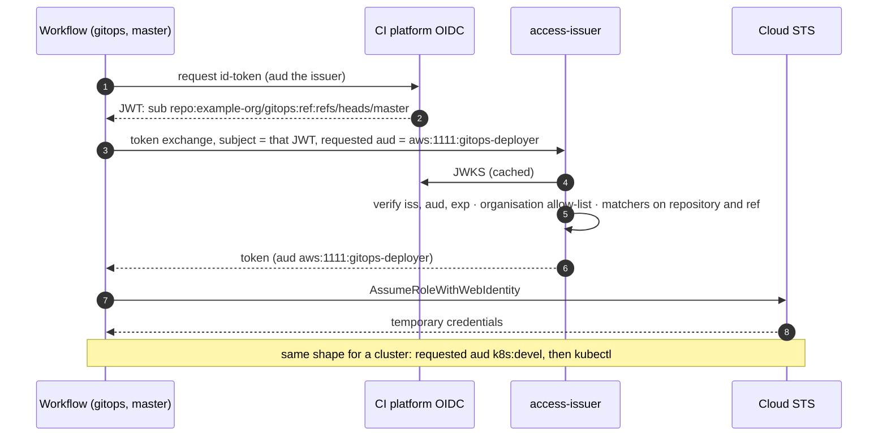

### 5.5 github-roster reconciles teams — no issuer involved

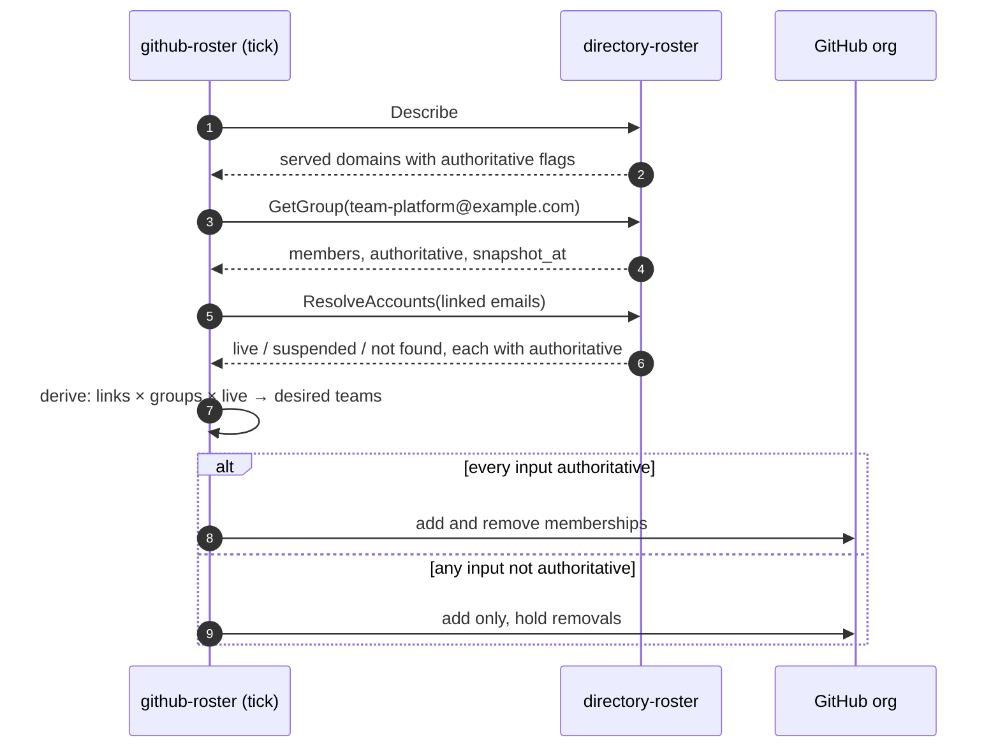

### 5.6 Connecting a workspace by admin consent

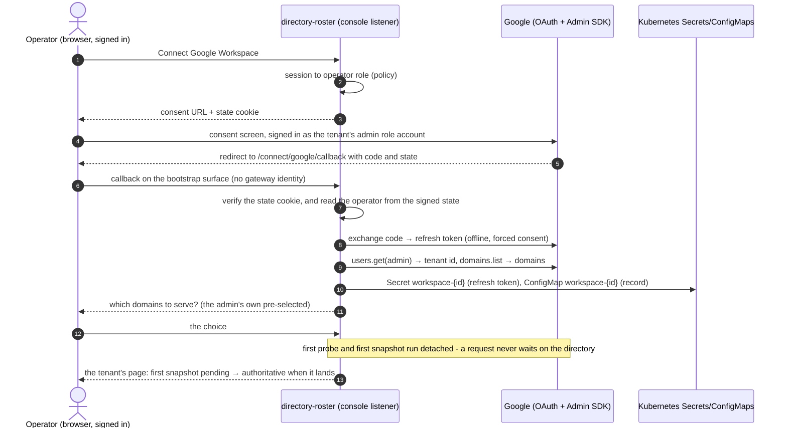

### 5.7 A login-time lookup with freshness

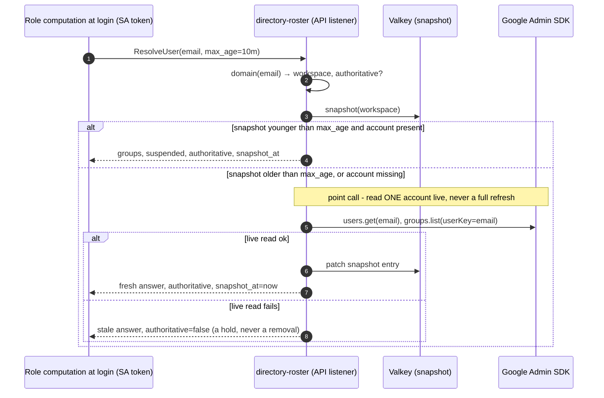

### 5.8 Day one of a standalone installation

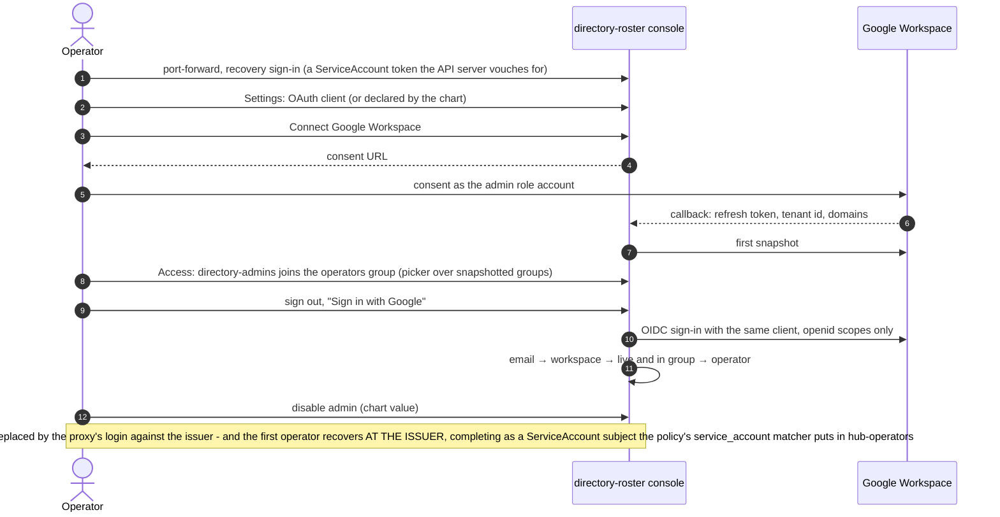

## 6. Failure semantics, in one table

| Situation | What consumers and operators see |
|---|---|
| Probe failed, snapshot still young | answers from the snapshot, `authoritative=false` |
| Snapshot older than the freshness window | same |
| Full refresh failed a page | old snapshot kept; nothing partial is ever served |
| Domain claimed by two workspaces | `authoritative=false` for that domain on both |
| Address in no served domain | `in_domain=false`: no opinion |
| Account missing from the snapshot | one live read first; `found=false` only after the backend said so |
| Valkey unreachable | every domain non-authoritative until it returns; the in-memory fallback is for a single replica only |
| Credential revoked or admin suspended | probe fails → provisional (*probe failed*); Reconnect is the recovery |
| A request would wait on the directory: the first snapshot, a list with no snapshot yet, a narrowing | it does not: the work runs detached and the answer is *first snapshot pending* — provisional, never a timeout at the gateway |
| A replica has no reader for a workspace the store knows (connected on another replica) | it opens one from the stored credential on first use; the store is the truth, the reader map a cache |
| A consent the directory granted fails on the first read | a page in the console's own style: the directory's message verbatim and the usual causes, most common first — never a 5xx, which the CDN in front replaces with its own page |
| A signed-in operator's own account turns non-authoritative | last granted role kept for a bounded window; no new identity granted anything |
| Consumer presents no token, a wrong audience, or a foreign ServiceAccount | `unauthenticated`; NetworkPolicy would have stopped most of these earlier |
| A caller presents the wrong anchor — a ServiceAccount token at a console, an issuer token at a listener that admits only local workloads | refused; the two anchors are never mixed on one port, and reaching a port proves nothing |
| access-issuer is down | no new logins anywhere; existing sessions and tokens live to expiry; break-glass is outside it |
| The hub is down | access-issuer keeps last-known groups within its hold window; github-roster holds removals |

The rule under all of them: **a consumer removes access only on an
authoritative answer.** Everything that can go wrong degrades to
*provisional*, never to "gone".
