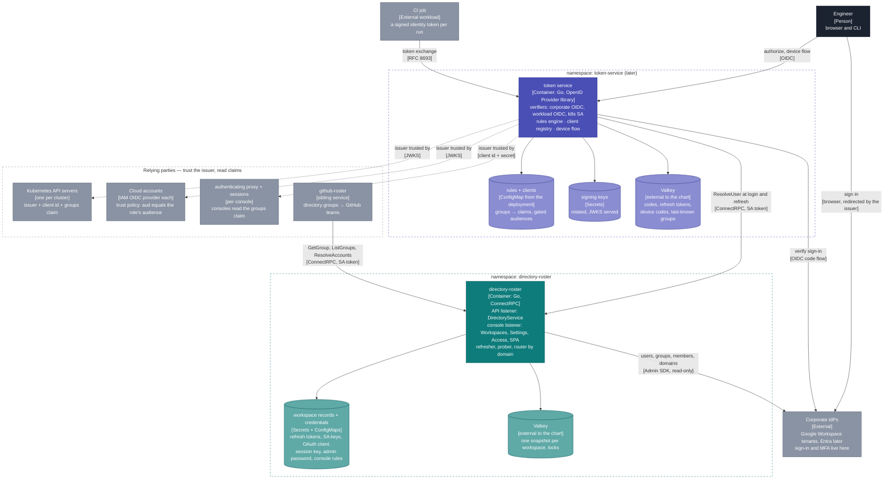
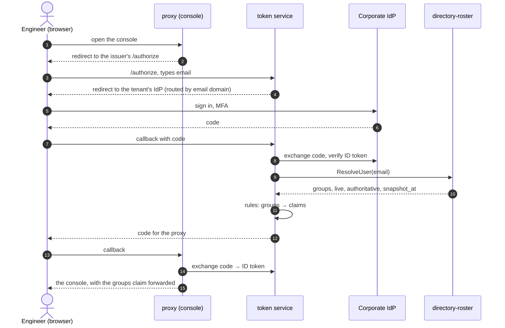
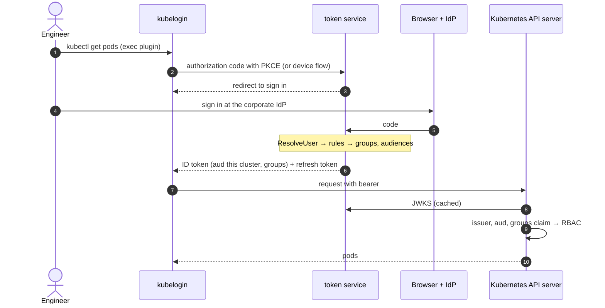
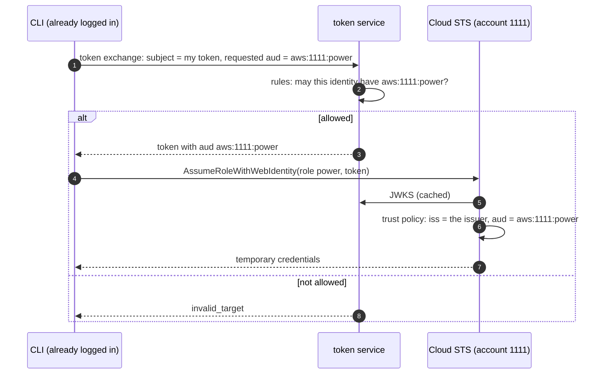
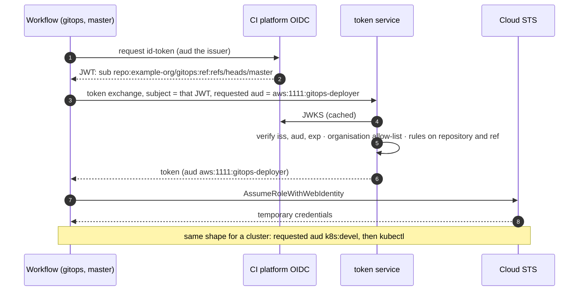
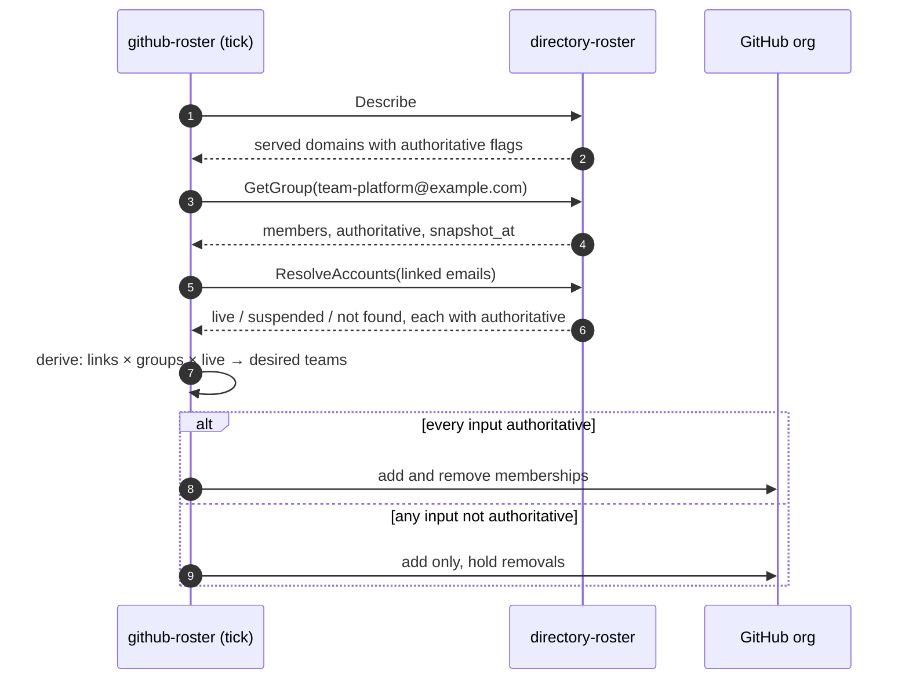
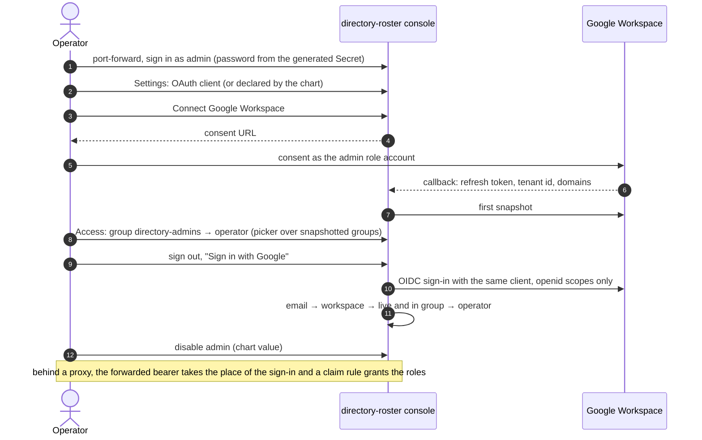

# Architecture — the family

Two components in one repository, and the relying parties around them.
The hub is [designed here](../design/hub.md) and drawn in detail in
[hub.md](hub.md); the token service is [designed here](../design/token-service.md)
and built later. This page is the picture end to end.

## Containers — C4 level 2

The hub sits behind exactly two callers and itself. Everything else reads
claims from the token service and never sees the hub. Neither component
has a database; neither authenticates anyone.

## Who owns what

| | directory-roster | token service | external |
|---|---|---|---|
| credentials held | directory read credentials — the only place they exist | its own signing keys | the IdPs hold users, passwords, MFA |
| knows | who exists, who is live, who is in which group, which domains each tenant owns, and whether that is authoritative | who just proved what | each relying party knows its own roles |
| decides | nothing about access; it answers | what a proof entitles you to | each relying party enforces on claims |
| authenticates | nobody | nobody | Google, Entra, the CI platform |
| issues | nothing | tokens to registered clients and exchanged tokens for workloads | the cloud issues credentials against the audience |
| operator surface | Workspaces, Settings, Access | one read-only page | proxies, unchanged |
| when down | the issuer keeps last-known groups within a window; github-roster holds removals | no new logins; sessions live to expiry; break-glass is outside | |

## Use cases

### A person opens a console behind an authenticating proxy

### kubectl on a cluster

### Cloud credentials without a directory service on the cloud side

### A CI job deploys

### github-roster reconciles teams — no issuer involved

### The hub's own console, day one

