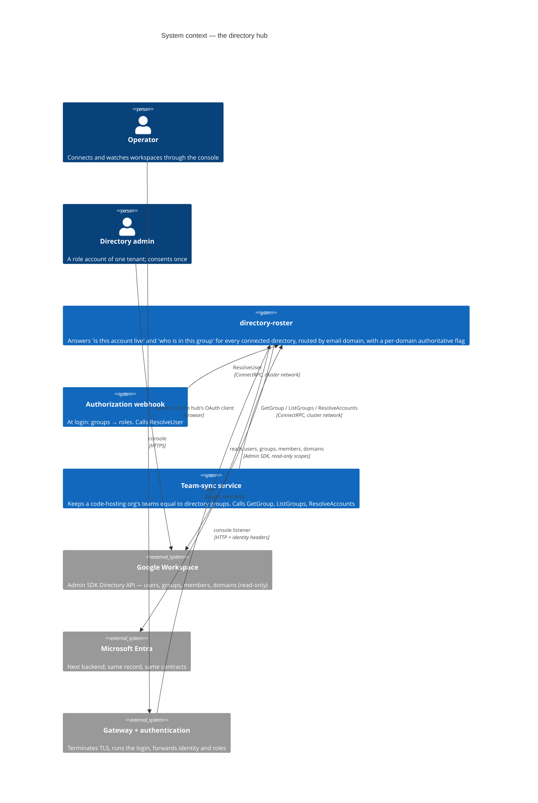
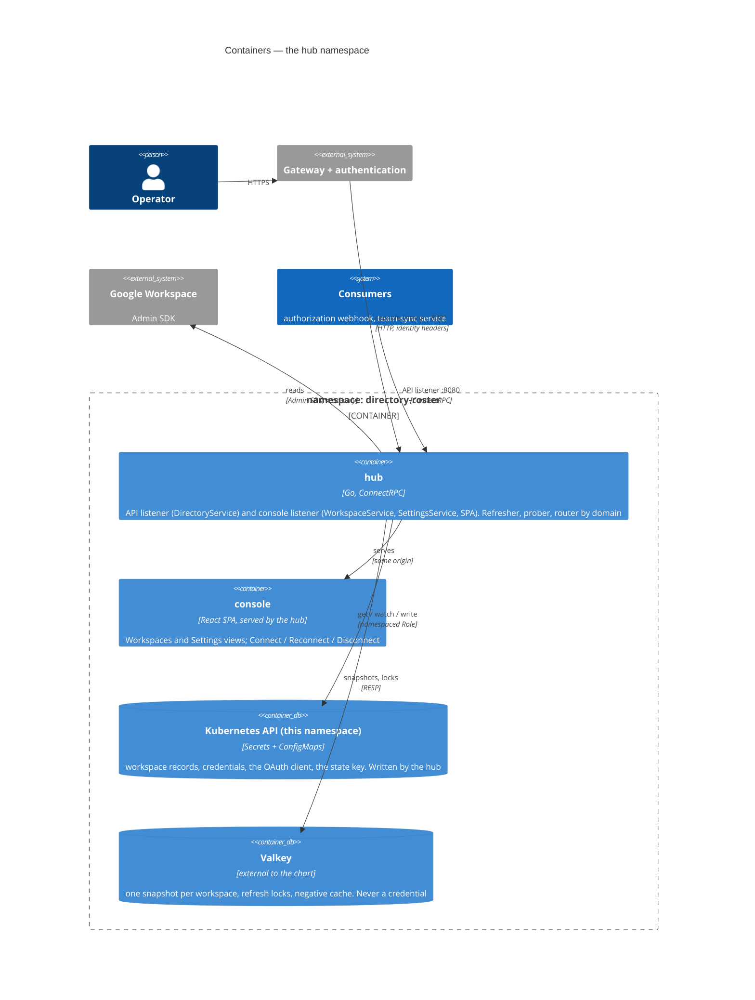
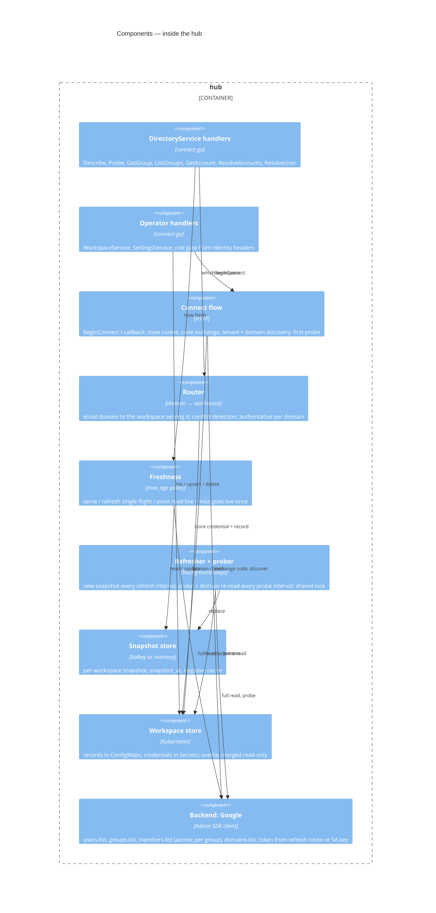

# Architecture

The hub in four views, from the outside in. The diagrams are C4 in
Mermaid; GitHub renders them inline. The design rationale is
[../design/hub.md](../design/hub.md); the contracts are
[../reference/contracts.md](../reference/contracts.md).

## 1. System context

Who talks to the hub, and what the hub talks to. Consumers hold no
directory credential; the hub holds all of them.



## 2. Containers

One process, two listeners, two stores, in a namespace of its own.



The two listeners are the privilege boundary: a consumer on the cluster
network can reach `DirectoryService` and nothing else; an operator RPC
exists only on the port the gateway forwards to. NetworkPolicy enforces
both.

## 3. Components

Inside the hub process.



## 4. Dynamics

### Connecting a workspace by admin consent

```mermaid
sequenceDiagram
  autonumber
  actor Op as Operator (browser)
  participant GW as Gateway + auth
  participant Hub as hub (console listener)
  participant G as Google (OAuth + Admin SDK)
  participant K as Kubernetes Secrets/ConfigMaps

  Op->>GW: Connect Google Workspace
  GW->>Hub: BeginConnect (identity headers: operator)
  Hub-->>Op: consent URL + state cookie
  Op->>G: consent screen, signed in as the tenant's admin role account
  G-->>Op: redirect /connect/google/callback?code&state
  Op->>GW: callback
  GW->>Hub: callback (still authenticated)
  Hub->>Hub: verify state cookie
  Hub->>G: exchange code → refresh token (offline, forced consent)
  Hub->>G: customers.get → tenant id; domains.list → domains
  Hub->>G: first probe (users.list page, groups.list page)
  Hub->>K: Secret workspace-<id> (refresh token), ConfigMap workspace-<id> (record)
  Hub-->>Op: Workspaces view: domains served, authoritative after the first snapshot
```

### A login-time lookup with freshness

```mermaid
sequenceDiagram
  autonumber
  participant W as Authorization webhook
  participant Hub as hub (API listener)
  participant V as Valkey (snapshot)
  participant G as Google Admin SDK

  W->>Hub: ResolveUser(email, max_age=10m)
  Hub->>Hub: domain(email) → workspace, authoritative?
  Hub->>V: snapshot(workspace)
  alt snapshot younger than max_age and account present
    Hub-->>W: groups, suspended, authoritative, snapshot_at
  else snapshot older than max_age, or account missing
    Note over Hub,G: point call: read ONE account live, never a full refresh
    Hub->>G: users.get(email); groups.list(userKey=email)
    alt live read ok
      Hub->>V: patch snapshot entry
      Hub-->>W: fresh answer, authoritative, snapshot_at=now
    else live read fails
      Hub-->>W: stale answer, authoritative=false (a hold, never a removal)
    end
  end
```

### The background loops

```mermaid
sequenceDiagram
  autonumber
  participant R as Refresher (one replica holds the lock)
  participant V as Valkey
  participant G as Google Admin SDK
  participant K as Kubernetes ConfigMaps

  loop every refresh interval, per workspace
    R->>V: SET NX lock:<workspace>
    R->>G: users.list, groups.list, members.list per group (atomic per group)
    alt every page ok
      R->>V: replace snapshot(<workspace>), snapshot_at=now
    else any page failed
      Note over R,V: keep the old snapshot; domains become non-authoritative once it ages past the freshness window
    end
    R->>V: DEL lock
  end
  loop every probe interval, per workspace
    R->>G: token check + domains.list
    R->>K: health, domains on the workspace record
  end
```

## 5. Failure semantics, in one table

| Situation | What consumers see |
|---|---|
| Probe failed, snapshot still young | answers from the snapshot, `authoritative=false` |
| Snapshot older than the freshness window | same |
| Full refresh failed a page | old snapshot kept; nothing partial is ever served |
| Domain claimed by two workspaces | `authoritative=false` for that domain on both |
| Address in no served domain | `in_domain=false`: no opinion |
| Account missing from the snapshot | one live read first; `found=false` only after the backend said so |
| Valkey unreachable | every domain non-authoritative until it returns; the in-memory fallback is for a single replica only |
| Credential revoked or admin suspended | probe fails → non-authoritative; Reconnect is the recovery |

The rule under all of them: **a consumer removes access only on an
authoritative answer.** Everything that can go wrong on the hub's side
degrades to "hold", never to "gone".
