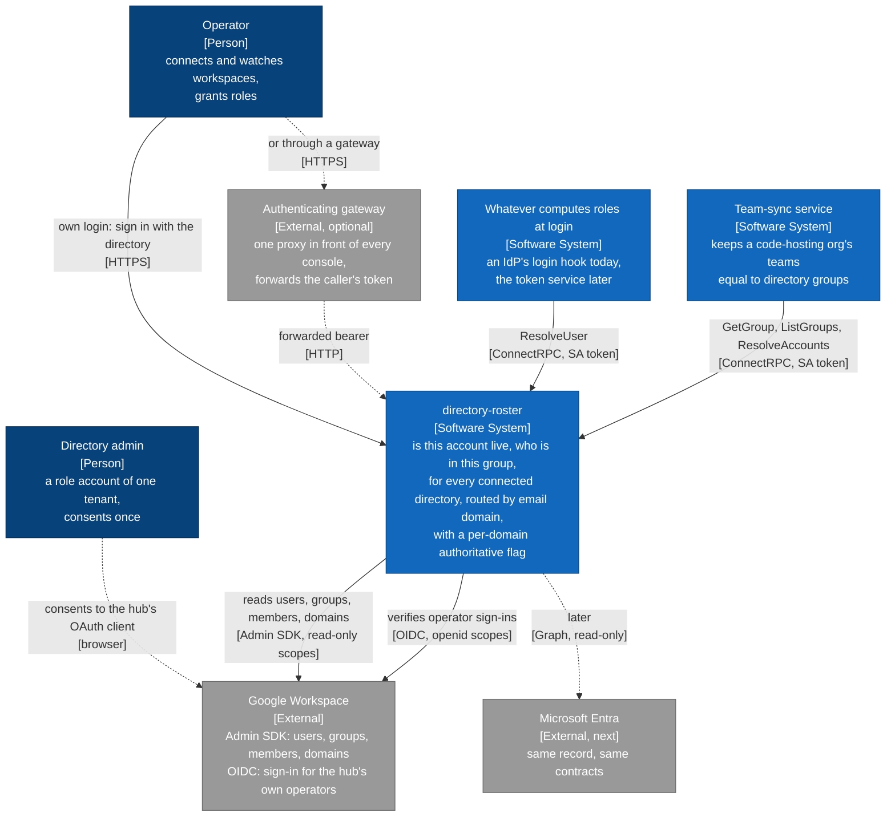
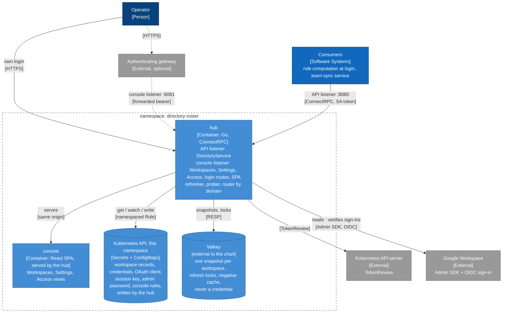
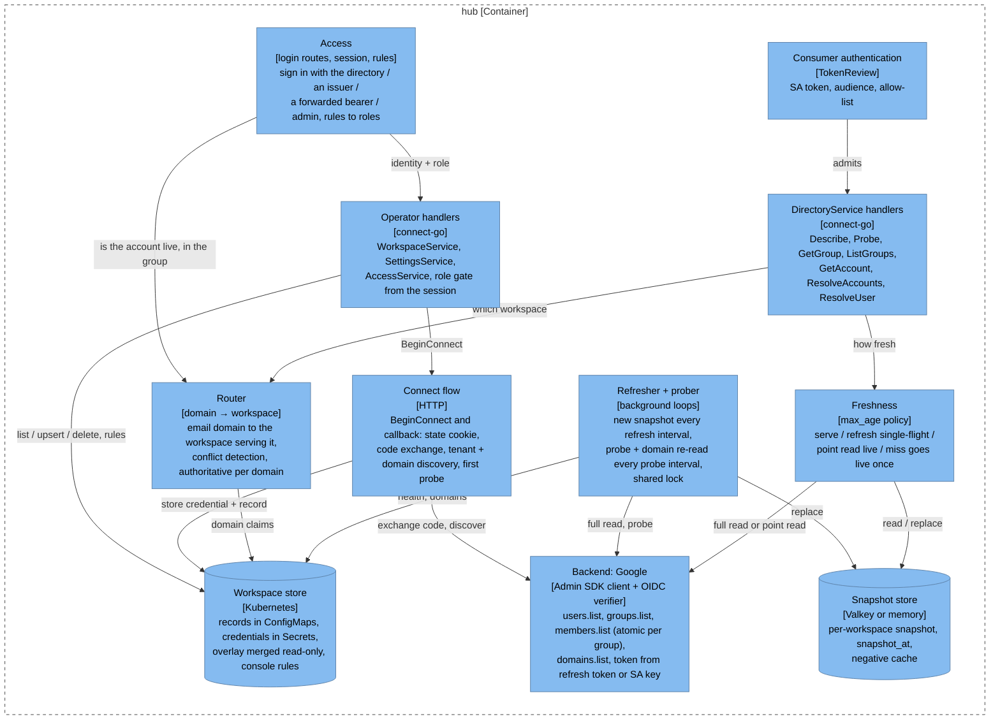
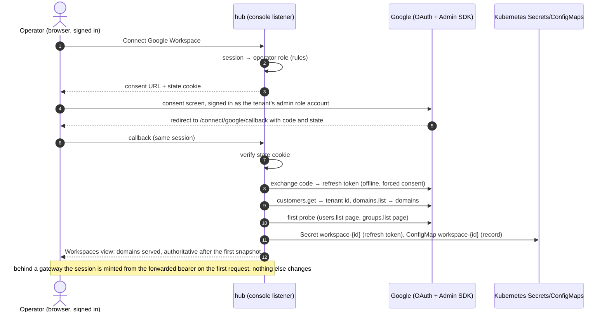
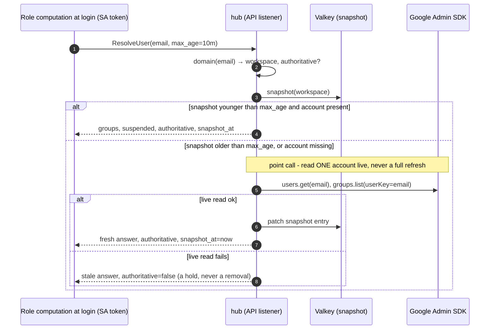
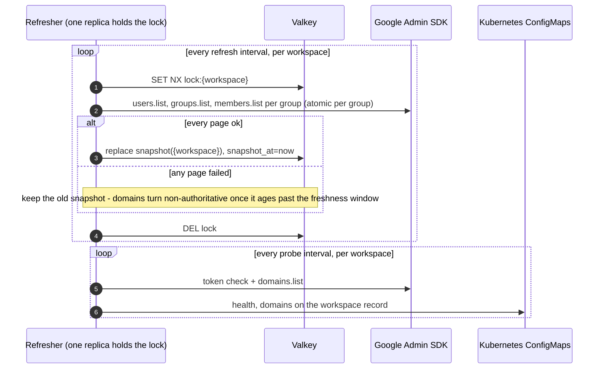

# Architecture

The hub in four views, from the outside in. The static views follow the
C4 model (context, containers, components) and are drawn as Mermaid
flowcharts with C4 styling — Mermaid's native C4 renderer overlaps labels
— so GitHub renders them inline. The design rationale is
[../design/hub.md](../design/hub.md); the contracts are
[../reference/contracts.md](../reference/contracts.md).

## 1. System context

Who talks to the hub, and what the hub talks to. Consumers hold no
directory credential; the hub holds all of them.

## 2. Containers

One process, two listeners, two stores, in a namespace of its own.

The two listeners are the privilege boundary: a consumer on the cluster
network can reach `DirectoryService` and nothing else, and only with an
allow-listed ServiceAccount token; an operator RPC exists only on the
console port, behind the hub's own session. NetworkPolicy enforces both
as the second layer. The family-level picture, with the token service
and the relying parties, is [access-roster.md](access-roster.md).

## 3. Components

Inside the hub process.

## 4. Dynamics

The hub's own sign-in and the day-one sequence are drawn in
[access-roster.md](access-roster.md); here, the two flows that are the
hub's alone.

### Connecting a workspace by admin consent

### A login-time lookup with freshness

### The background loops

## 5. Failure semantics, in one table

| Situation | What consumers see |
|---|---|
| Probe failed, snapshot still young | answers from the snapshot, `authoritative=false` |
| Snapshot older than the freshness window | same |
| Full refresh failed a page | old snapshot kept; nothing partial is ever served |
| Domain claimed by two workspaces | `authoritative=false` for that domain on both |
| Address in no served domain | `in_domain=false`: no opinion |
| Account missing from the snapshot | one live read first; `found=false` only after the backend said so |
| Valkey unreachable | every domain non-authoritative until it returns; the in-memory fallback is for a single replica only |
| Credential revoked or admin suspended | probe fails → non-authoritative; Reconnect is the recovery |
| A signed-in operator's own account turns non-authoritative | last granted role kept for a bounded window; no new identity granted anything |
| Consumer presents no token, a wrong audience, or a foreign ServiceAccount | `unauthenticated`; NetworkPolicy would have stopped most of these earlier |

The rule under all of them: **a consumer removes access only on an
authoritative answer.** Everything that can go wrong on the hub's side
degrades to "hold", never to "gone".
