# Integrations — the helicopter view

Every point where something outside talks to something in this
repository, numbered once here and explained case by case below. The
structural drawing is [architecture.md](architecture.md); the how-to per
relying party is under [connect/](connect/).

Every arrow below rests on one of **two trust anchors**, and the choice is
made by scope, never by preference ([design/trust.md](design/trust.md)):
**the cluster** — a ServiceAccount token the API server checks — for a
workload calling a service in the same cluster; **the issuer** — a token
signed by access-issuer — for everything further away: another cluster,
a laptop, a person, a CI job. Each case names its anchor.

```mermaid
flowchart TB
  subgraph in["Identity comes from"]
    direction LR
    gws["Google Workspace tenants<br/>(one per company)"]:::ext
    entra["Microsoft Entra<br/>(later)"]:::ext
    gh["GitHub Actions<br/>OIDC tokens"]:::ext
    sa["Kubernetes<br/>ServiceAccounts"]:::ext
  end

  subgraph ar["access-roster"]
    direction LR
    hub["the directory<br/>inside access-issuer"]:::hub
    iss["access-issuer<br/>the issuer, the console"]:::token
    ghr["github-roster<br/>the controller, same chart"]:::token
    proxy["access-proxy<br/>one per console"]:::token
    lib["Go module · TS package<br/>inside applications"]:::token
    ctl["accessctl<br/>on laptops and in jobs"]:::token
    act["exchange action<br/>in workflows"]:::token
  end

  subgraph out["Access goes to"]
    direction LR
    eks["Kubernetes API servers<br/>(one issuer each)"]:::ext
    aws["AWS accounts<br/>(IAM OIDC provider each)"]:::ext
    argo["ArgoCD · Kargo"]:::ext
    consoles["Consoles<br/>(ours and business test surfaces)"]:::ext
    ghteams["GitHub organisations<br/>teams, and runner Apps"]:::ext
    reg["ECR · CodeArtifact · any AWS service<br/>(on top of the profiles)"]:::ext
  end

  gws -- "① Admin SDK reads<br/>admin consent or SA key" --> hub
  entra -. "① Graph reads (later)" .-> hub
  gws -- "② OIDC sign-in<br/>people" --> iss
  gh -- "③ token exchange<br/>jobs" --> iss
  sa -- "④ token exchange<br/>workloads, by the cluster's key set" --> iss
  iss -- "⑤ who is this address<br/>a function call" --> hub
  iss -- "⑥ issuer + client id<br/>groups claim" --> eks
  iss -- "⑦ issuer + audience<br/>trust policy per role" --> aws
  iss -- "⑧ static clients<br/>groups claim" --> argo
  iss -- "⑨ login" --> proxy
  proxy -- "⑩ forwarded bearer" --> consoles
  lib -. "⑪ reads the bearer,<br/>serves /.access/whoami" .-> consoles
  ctl -- "⑫ code + PKCE on loopback,<br/>then exchange" --> iss
  act -- "⑬ exchange, shell only" --> iss
  iss -. "⑭ who holds each group<br/>console API, own ServiceAccount token" .-> ghr
  ghr -- "⑭ invites, teams, removals<br/>as each organisation's App" --> ghteams
  aws -. "⑮ AWS's own tooling<br/>with --profile" .-> reg

  classDef ext fill:#8A93A3,stroke:#5E6675,color:#fff
  classDef hub fill:#0E7C7B,stroke:#0A5958,color:#fff
  classDef token fill:#4A4FB5,stroke:#33378A,color:#fff
  style in fill:none,stroke:#8A93A3,stroke-dasharray:5 5
  style out fill:none,stroke:#8A93A3,stroke-dasharray:5 5
  style ar fill:none,stroke:#4A4FB5,stroke-dasharray:5 5
```

## The batteries, by kind of artifact

| Kind | Name | What it is | Who deploys or uses it | Status |
|---|---|---|---|---|
| **Service** | access-issuer | the whole of access-roster | the platform, once per installation | **running** since 0.6; the directory folded in at 0.12 ([design](design/access-roster.md)); all four OpenID profiles run with no failure ([conformance](conformance.md)) |
| **Service** | github-roster | the GitHub controller: one loop beside the service that keeps every connected organisation's teams as the policy says | the platform, from the same chart | **acting** since 1.5; each organisation a dry run until listed in `githubRoster.actsIn` |
| **Helm chart** | `access-issuer` | the whole service, both processes; expects a Valkey, and an audit installation to record into | the platform | published per tag |
| **Helm chart** | `access-proxy` | oauth2-proxy and its wiring in front of one console with no OpenID flow of its own; expects a Valkey; its client is one declared row | Envoy Gateway, the only gateway it runs on | **deprecated, removal planned** ([ADR 0003](decisions/0003-deprecate-access-proxy.md)); **no console in this repository runs behind it** — the directory console left it at 0.12, because it signs in as a client of the issuer it shares an origin with. Gateway-native OIDC (an Envoy Gateway `SecurityPolicy` with `oidc:`) replaces it there now; for a gateway that is not Envoy Gateway, the path is running upstream oauth2-proxy yourself, not this chart. This chart's server-side session store was never the reason to prefer it either way, since oauth2-proxy's encrypted cookie means no server side, Back-Channel Logout included, can end a session it holds |
| **Go module** | `github.com/truvity/access-roster` | `identity` (the two verifiers and a net/http middleware), `policy`, `backend`, `tokens` | every Go service and console | published per tag |
| **TypeScript package** | `@truvity/access-roster`, on GitHub Packages | `useIdentity()`, `<UserBadge/>` over `/.access/whoami`; `/server` verifies a bearer in Node | every console UI, and Node services | published per tag |
| **CLI** | `accessctl` | `login`, `setup`, `kubeconfig`, `aws-config`, `kube-token`, `aws`, `token`, `whoami`, `exchange` | people, on laptops, and a CI job with the same files | built; a Nix flake on every release, for devbox |
| **GitHub Action** | `truvity/access-roster` (root `action.yml`), pinned to a release | shell only: exchanges the job's token, writes a kubeconfig and AWS profiles | every workflow that deploys | built |
| **Store** | the audit trail | not this service's: an installation of [truvity/audit](https://github.com/truvity/audit) in this service's namespace keeps it, locks it and signs it. This service declares what it can record in a catalogue, sends a record per action, and reads that installation's query service for the console's Audit page | the platform, one installation per application | connected since 1.26; kept in a bucket of its own until then, which ages out under its lock. A recovery sign-in is the one action refused when its record cannot be kept |
| **File format** | the policy | groups, claims, lifetimes, clients, resources, client documents and GitHub bindings — one schema for both services | the platform, in its own repository, rendered from its access matrix | in force |
| **Contracts** | `proto/directory/v1`, `proto/directoryroster/v1` | DirectoryService and the console's own services | consumers of access-roster | now |
| **Documentation** | `docs/connect/*` | one guide per kind of relying party, plus the recipes that run on top of the profiles | everyone | now |

## What is ours and what is third-party

| Ours (this repository) | Third-party, used as is |
|---|---|
| access-issuer and its GitHub controller, the access-proxy **chart** (wiring and conventions around a third-party proxy), the Go module, the TypeScript package, accessctl, the exchange action, the policy schema | Google Workspace (sign-in, MFA, directory) — Entra the same way once its backend is built, GitHub Actions OIDC, Envoy Gateway, **oauth2-proxy** (the process inside access-proxy), Valkey, kubelogin, kubectl, the AWS CLI, `curl` and `jq` in the action, the OpenID Provider library the issuer is built on |

Cases ⑥, ⑦ and ⑧ read `aud` as the client asking. Since v1.29.0 a client
may instead name a **resource** it wants a token *for* (RFC 8707) — a
service the client is not itself, gated by that resource's own
`requires` alongside the client's — and a client this installation does
not deploy may present a URL as its own `client_id` instead of a policy
row, admitted only from an allow-listed origin. Both are declared and off
unless written; [reference/policy.md](reference/policy.md#resources--what-a-token-is-for)
is where each is defined.

## Case by case

Each row: who is involved, what trusts what, in one line, and the guide
with the full mechanism — the flow, what to configure, what you get.

| # | Case | Anchor | What happens | Guide |
|---|---|---|---|---|
| ① | A corporate directory → access-roster | none of ours — the directory's own OAuth | admin consent, or a service-account key with domain-wide delegation; the service discovers the tenant and its domains and re-reads on a schedule | [connect/corporate-directory.md](connect/corporate-directory.md) |
| ② | A person signs in → the issuer | produces the issuer anchor; the corporate IdP is the proof | routed to the right tenant by domain, signs in there with MFA, and the issuer asks the directory (⑤) then mints | [design/access-roster.md](design/access-roster.md), [operations/connect-runbook.md](operations/connect-runbook.md) |
| ③ | A CI job → the issuer | produces the issuer anchor; GitHub's token is the proof | the job exchanges GitHub's identity token for a client's audience, gated by an owner allow-list and matchers on repository, ref and visibility | [connect/github-actions.md](connect/github-actions.md) |
| ④ | A workload proves itself → the issuer | the cluster that issued the token, by its own published key set | exchange, verified against the key set the workload's own cluster publishes — never a TokenReview against a cluster this service would then have to hold access to | [connect/service-to-service.md](connect/service-to-service.md) |
| ⑤ | The issuer asks the directory | — | every login and refresh is a function call, in one process; a failure is an error and never an empty answer, which is what a bounded hold window rests on | [design/access-roster.md](design/access-roster.md) |
| ⑥ | The issuer → a Kubernetes cluster | the issuer; the API server reads `groups` | one OIDC provider per cluster, one public client, RBAC bound to internal group names exactly as the policy spells them | [connect/kubernetes-cluster.md](connect/kubernetes-cluster.md) |
| ⑦ | The issuer → an AWS account | the issuer; the trust policy reads `aud` | one IAM OIDC provider per account, one trust policy per role, `AssumeRoleWithWebIdentity` | [connect/aws-account.md](connect/aws-account.md) |
| ⑧ | The issuer → ArgoCD and Kargo | the issuer | their own OIDC login, reading `groups` through their own policy, unchanged | [connect/argocd.md](connect/argocd.md), [connect/kargo.md](connect/kargo.md) |
| ⑨+⑩ | A console behind a proxy | the issuer, only | gateway-native OIDC by default on Envoy Gateway, `access-proxy` (deprecated) there until migrated, or upstream oauth2-proxy run by hand on any other gateway | [connect/console-app.md](connect/console-app.md), [connect/business-surface.md](connect/business-surface.md) |
| ⑪ | An application reads who is calling | whichever its listener was built for | the Go module or the TypeScript package verifies a bearer and reads `groups`; no relying party re-maps a name | [reference/go-module.md](reference/go-module.md), [reference/typescript.md](reference/typescript.md) |
| ⑫ | A person's laptop | the issuer | `accessctl login` once; `kubeconfig`, `aws-config`, `token` and `credential` all exchange the cached sign-in | [reference/accessctl.md](reference/accessctl.md) |
| ⑬ | A workflow | the issuer, by exchange (③) | one shell-only step exchanges the job's own token and writes a kubeconfig and an AWS profile | [connect/github-actions.md](connect/github-actions.md) |
| ⑭ | GitHub teams | none of ours — a GitHub App per organisation | the controller asks who holds each bound group and invites, adds, promotes and removes — the **sync model**, because GitHub can be written to | [connect/github-organisation.md](connect/github-organisation.md), [connect/github-apps-catalogue.md](connect/github-apps-catalogue.md), [connect/infrastructure-as-code.md](connect/infrastructure-as-code.md) |
| ⑮ | Registries, artifacts and every other AWS service | none of ours — an AWS credential from ⑦ | `--profile <role>@<account>`, then the service's own login: ECR's credential helper, `aws codeartifact login`, and so on | [connect/registries-and-artifacts.md](connect/registries-and-artifacts.md) |
| ⑯ | Break-glass | the cluster, used deliberately as the floor | a person mints a ServiceAccount token and signs in with it, for the day the directory is broken and the issuer's own anchor is unavailable by construction | [operations/runbook.md#lost-operator-access](operations/runbook.md#lost-operator-access) |
| ⑰ | The issuer → a secret manager that mints certificates | the issuer; the manager's JWT mount reads `aud` and `groups` | exchange for `openbao`, log in on the mount, one `sign` call, the manager's token is revoked | [connect/openbao.md](connect/openbao.md) |

## Reading the two models together

Cases ⑥ ⑦ ⑧ ⑩ ⑮ ⑰ are the **claims model**: the decision rides in a token,
because a cluster, a cloud account or a session cannot call a directory.
Case ⑭ is the **sync model**: the decision is materialized where it is
enforced, because GitHub can be written to. Both draw from the same directory
and the same policy; the choice per relying party is dictated by what that
relying party can consume, never by preference.

And underneath both, the **two anchors** — and the split between them
has moved. ⑯ alone stands on the cluster now: recovery, the way in on the
day the directory is broken, which must depend on nothing else.
Everything else stands on the issuer, ④ included, because a workload is
proven against the key set its OWN cluster publishes rather than by
asking an API server we would have to hold access to.
