# Integrations — the helicopter view

Every point where something outside talks to something in this
repository, numbered once here and explained case by case below. The
structural drawing is [architecture.md](architecture.md); the how-to per
relying party is under [connect/](connect/).

```mermaid
flowchart TB
  subgraph in["Identity comes from"]
    direction LR
    gws["Google Workspace tenants<br/>(one per company)"]:::ext
    entra["Microsoft Entra<br/>(later)"]:::ext
    gh["GitHub Actions<br/>OIDC tokens"]:::ext
    sa["Kubernetes<br/>ServiceAccounts"]:::ext
  end

  subgraph ar["access-roster"]
    direction LR
    hub["directory-roster<br/>the directory hub"]:::hub
    iss["access-issuer<br/>the issuer"]:::token
    proxy["access-proxy<br/>one per console"]:::token
    lib["Go module · TS package<br/>inside applications"]:::token
    ctl["accessctl<br/>on laptops"]:::token
    act["exchange action<br/>in workflows"]:::token
  end

  subgraph out["Access goes to"]
    direction LR
    eks["Kubernetes API servers<br/>(one issuer each)"]:::ext
    aws["AWS accounts<br/>(IAM OIDC provider each)"]:::ext
    argo["ArgoCD · Kargo"]:::ext
    consoles["Consoles<br/>(ours and business test surfaces)"]:::ext
    ghteams["GitHub teams<br/>via github-roster"]:::ext
    reg["ECR · CodeArtifact · any AWS service<br/>(on top of the profiles)"]:::ext
  end

  gws -- "① Admin SDK reads<br/>admin consent or SA key" --> hub
  entra -. "① Graph reads (later)" .-> hub
  gws -- "② OIDC sign-in<br/>people" --> iss
  gh -- "③ token exchange<br/>jobs" --> iss
  sa -- "④ TokenReview<br/>workloads" --> hub
  iss -- "⑤ ResolveUser" --> hub
  iss -- "⑥ issuer + client id<br/>groups claim" --> eks
  iss -- "⑦ issuer + audience<br/>trust policy per role" --> aws
  iss -- "⑧ static clients<br/>groups claim" --> argo
  iss -- "⑨ login,<br/>self-registration" --> proxy
  proxy -- "⑩ forwarded bearer" --> consoles
  lib -. "⑪ reads the bearer,<br/>serves /.access/whoami" .-> consoles
  ctl -- "⑫ device flow, exchange" --> iss
  act -- "⑬ exchange, shell only" --> iss
  hub -- "⑭ groups, liveness,<br/>authoritative" --> ghteams
  aws -. "⑮ AWS's own tooling<br/>with --profile" .-> reg

  classDef ext fill:#8A93A3,stroke:#5E6675,color:#fff
  classDef hub fill:#0E7C7B,stroke:#0A5958,color:#fff
  classDef token fill:#4A4FB5,stroke:#33378A,color:#fff
  style in fill:none,stroke:#8A93A3,stroke-dasharray:5 5
  style out fill:none,stroke:#8A93A3,stroke-dasharray:5 5
  style ar fill:none,stroke:#4A4FB5,stroke-dasharray:5 5
```

## The batteries, by kind of artifact

| Kind | Name | What it is | Who deploys or uses it | Status |
|---|---|---|---|---|
| **Service** | directory-roster | the directory hub | the platform, once per installation | design under review, prototype next |
| **Service** | access-issuer | the token service | the platform, once per installation | designed, after the hub |
| **Helm chart** | `directory-roster` | the hub's chart; expects a Valkey | the platform | with the hub |
| **Helm chart** | `access-issuer` | the issuer's chart; expects a Valkey and the hub | the platform | with the issuer |
| **Helm chart** | `access-proxy` | oauth2-proxy and its wiring in front of one console; self-registers at the issuer; expects a Valkey | every team that ships a console, one release per console | with the issuer |
| **Go module** | `github.com/truvity/access-roster` | `identity` with net/http, fiber v3, gRPC and connect adapters; `authz`; `directory`; `tokens`; `policy`; `connect` | every Go service and console | `identity` core with the hub, the rest with the issuer |
| **TypeScript package** | `access-roster` | `useIdentity()`, `<UserBadge/>`, generated clients | every console UI | with the hub's console |
| **CLI** | `accessctl` | `login`, `setup`, `kubeconfig`, `aws-config`, `kube-token`, `aws`, `whoami`, `exchange`, `policy test` | people, on laptops; never machines | with the issuer |
| **GitHub Action** | `truvity/access-roster@v1` (root `action.yml`) | shell only: exchanges the job's token, writes a kubeconfig and AWS profiles | every workflow that deploys | with the issuer |
| **File format** | the policy | groups, claims, lifetimes, clients, memberships — one schema for both services | the platform, in gitops; memberships also from the console | with the hub's console, extended by the issuer |
| **Contracts** | `proto/directory/v1`, `proto/directoryroster/v1` | DirectoryService and the hub's console services | consumers of the hub | now |
| **Documentation** | `docs/connect/*` | one guide per kind of relying party, plus the recipes that run on top of the profiles | everyone | now |

## What is ours and what is third-party

| Ours (this repository) | Third-party, used as is |
|---|---|
| directory-roster, access-issuer, the access-proxy **chart** (wiring, conventions and a registration init step around a third-party proxy), the Go module, the TypeScript package, accessctl, the exchange action, the policy schema | Google Workspace and Entra (sign-in, MFA, directory), GitHub Actions OIDC, Envoy Gateway, **oauth2-proxy** (the process inside access-proxy), Valkey, kubelogin, kubectl, the AWS CLI, `curl` and `jq` in the action, the OpenID Provider library the issuer is built on |

## Case by case

Each case: who is involved, what trusts what, the flow, what you
configure and where, what you get.

### ① A corporate directory → the hub

- **Parties:** a Workspace admin (role account), directory-roster.
- **Trust:** the Workspace grants the hub's OAuth client read-only Admin
  SDK scopes by admin consent, or a service-account key with domain-wide
  delegation.
- **Flow:** Connect in the console → consent → the hub stores the refresh
  token, discovers the tenant id and domains, takes the first snapshot,
  then re-reads every 15 minutes and probes every 5.
- **You configure:** once per installation, the OAuth client; once per
  Workspace, one consent click. Nothing per user or group.
- **You get:** every address routed to its workspace; `live` and `groups`
  for anyone; an **authoritative** flag per domain.
- Guide: [operations/connect-runbook.md](operations/connect-runbook.md).

### ② A person signs in → the issuer

- **Parties:** a person, their corporate IdP, access-issuer.
- **Trust:** the issuer is an ordinary OIDC client of the corporate IdP,
  openid scopes only.
- **Flow:** the person types their email at the issuer → routed by domain
  to the right tenant → signs in there with MFA → back at the issuer, ⑤
  asks the hub → policy → token.
- **You configure:** one OIDC client per backend (Google, later Entra) in
  the issuer's values. Not per tenant: tenants are discovered.
- **You get:** one login for every relying party; a suspended account
  cannot sign in even though Google would still sign it in.

### ③ A CI job → the issuer

- **Parties:** a GitHub Actions job, access-issuer.
- **Trust:** the issuer verifies GitHub's token against GitHub's keys and
  an organisation allow-list; nothing trusts GitHub directly.
- **Flow:** the job requests its identity token → the action exchanges it
  at the issuer for each requested audience → matchers on repository,
  ref and workflow decide → the job gets tokens for ⑥ and ⑦.
- **You configure:** the organisations in the issuer's values; a machine
  group with the matcher, and the clients that require it; one step in
  the workflow.
- **You get:** no stored secret anywhere; a fork branch gets nothing.
- Guide: [connect/github-actions.md](connect/github-actions.md).

### ④ A workload → the hub

- **Parties:** an in-cluster consumer (the issuer, github-roster), the
  hub's API listener.
- **Trust:** the consumer presents a projected ServiceAccount token with
  audience `directory-roster`; the hub verifies it with TokenReview
  against an allow-list.
- **You configure:** a projected volume in the consumer, a
  `namespace/serviceAccount` line in the hub's values.
- **You get:** no API keys; a token that dies with the pod.
- Guide: [reference/configuration.md](reference/configuration.md#consumers).

### ⑤ The issuer asks the hub

- Every login and refresh: `ResolveUser(email)` → groups, live,
  authoritative. Non-authoritative answers hold last-known grants for a
  bounded window; new identities get nothing. This is the second half of
  global logout and the whole of the leaver story.

### ⑥ The issuer → a Kubernetes cluster

- **Parties:** an EKS API server, access-issuer, kubelogin or accessctl
  or a job's token.
- **Trust:** the cluster's single OIDC provider is the issuer, client id
  `k8s:<cluster>`, groups claim `groups`.
- **Flow:** kubelogin's device or code flow (people) or the action's
  exchange (jobs) → a token with the cluster's audience and the group
  values → RBAC as today.
- **You configure:** the cluster's OIDC provider once; a public client
  `k8s:<cluster>` in the issuer; the internal groups it requires and the
  fragments that mint the values; RBAC bindings by group as before.
- **You get:** kubeconfigs written by `accessctl kubeconfig` for every
  cluster a person is granted; no kubeconfig generation elsewhere.
- Guide: [connect/kubernetes-cluster.md](connect/kubernetes-cluster.md).

### ⑦ The issuer → an AWS account

- **Parties:** an AWS account, access-issuer, `accessctl aws` or a job's
  token.
- **Trust:** one IAM OIDC provider for the issuer per account; per role a
  trust policy requiring `aud == aws:<account>:<role>`.
- **Flow:** exchange for the role's audience, gated by the client's
  `requires` →
  `AssumeRoleWithWebIdentity` → temporary credentials. People through a
  `credential_process`, jobs through a web-identity token file.
- **You configure:** the provider once per account; a trust policy per
  role; the internal groups each client requires.
- **You get:** group-based cloud roles across several organisations
  without Identity Center, and one trust policy per role instead of
  per-user statements.
- Guide: [connect/aws-account.md](connect/aws-account.md).

### ⑧ The issuer → ArgoCD and Kargo

- **Trust:** a static client each, plus a public one for Kargo's CLI.
- **Flow:** their own OIDC login against the issuer; they read `groups`
  and apply their own policy, unchanged.
- **You configure:** the clients in the issuer; issuer URL and client id
  in their values; their admin accounts off once a policy-granted admin has
  signed in.
- Guides: [connect/argocd.md](connect/argocd.md), [connect/kargo.md](connect/kargo.md).

### ⑨ + ⑩ A console behind access-proxy

- **Parties:** a person, the gateway, access-proxy, the console.
- **Trust:** the proxy self-registers as a client of the issuer with its
  ServiceAccount token; the gateway routes the hostname to the proxy as
  external authorization; the console trusts the bearer the proxy
  forwards, verified by the library.
- **Flow:** open the host → proxy redirects to the issuer → ② → session in
  Valkey → every request forwarded with the bearer → console reads it.
- **You configure:** an eight-line `access-proxy` release per console;
  DNS; an internal group whose fragment mints the console's values; the namespace label the
  fleet egress policy selects.
- **You get:** login, session, refresh in the background, global sign-out
  and a posture (`groups` or `authenticated`) without a line of console
  code.
- Guides: [connect/console-app.md](connect/console-app.md),
  [connect/business-surface.md](connect/business-surface.md).

### ⑪ An application reads who is calling

- **Go:** `identity` verifier + one of four middleware adapters
  (net/http, fiber v3, gRPC, connect) puts an `Identity` in the context
  and serves `/.access/whoami`; `authz.Role("operator")` gates a handler.
- **TypeScript:** `useIdentity()` and `<UserBadge/>` read that endpoint.
- **You configure:** the issuer URL and your hostname as audience.
- Reference: [reference/go-module.md](reference/go-module.md),
  [reference/typescript.md](reference/typescript.md).

### ⑫ A person's laptop

- `accessctl login` once; `accessctl kubeconfig` and `aws-config` write
  the files for everything the policy grants; kubectl and the AWS CLI then
  work as usual through the exec plugin and the credential process.
  kubelogin is an equivalent for kubectl. Machines never run accessctl.
- Reference: [reference/accessctl.md](reference/accessctl.md).

### ⑬ A workflow

- One shell-only step exchanges the job's token at the issuer and writes
  a kubeconfig and an AWS profile. Policy is in the policy file, not in the
  workflow.

### ⑭ GitHub teams

- github-roster, a sibling service, reads the hub over ④ every tick and
  keeps bound teams equal to directory groups, removing only on
  authoritative answers. No issuer involved: this is the sync model.

### ⑮ Registries, artifacts and every other AWS service

- **Parties:** ECR, CodeArtifact, anything on AWS; the profiles ⑦ and ⑫ or
  ⑬ prepared.
- **Trust:** none of their own; they consume an AWS credential.
- **Flow:** `--profile <role>@<account>`, then the service's own login:
  Amazon's ECR credential helper or action, `aws codeartifact login` per
  tool. Many registries and domains are many profiles.
- **You configure:** roles whose only purpose is registry or artifact
  access, required by those clients; the tool-specific line per registry or domain.
- **You get:** a push or a package install that never sees an expired
  login, with the entitlement decided in the policy.
- Guide: [connect/registries-and-artifacts.md](connect/registries-and-artifacts.md).

## Reading the two models together

Cases ⑥ ⑦ ⑧ ⑩ ⑮ are the **claims model**: the decision rides in a token,
because a cluster, a cloud account or a session cannot call the hub.
Case ⑭ is the **sync model**: the decision is materialized where it is
enforced, because GitHub can be written to. Both draw from the same hub
and the same policy; the choice per relying party is dictated by what that
relying party can consume, never by preference.
