# Integrations — the helicopter view

Every point where something outside talks to something in this
repository, numbered once here and explained case by case below. The
structural drawing is [architecture.md](architecture.md); the how-to per
relying party is under [connect/](connect/).

Every arrow below rests on one of **two trust anchors**, and the choice is
made by scope, never by preference ([design/trust.md](design/trust.md)):
**the cluster** — a ServiceAccount token the API server checks — for a
workload calling a service in the same cluster; **the issuer** — a token
signed by access-issuer — for everything further away: another cluster,
a laptop, a person, a CI job. Each case names its anchor.

```mermaid
flowchart TB
  subgraph in["Identity comes from"]
    direction LR
    gws["Google Workspace tenants<br/>(one per company)"]:::ext
    entra["Microsoft Entra<br/>(later)"]:::ext
    gh["GitHub Actions<br/>OIDC tokens"]:::ext
    sa["Kubernetes<br/>ServiceAccounts"]:::ext
  end

  subgraph ar["access-roster"]
    direction LR
    hub["the directory<br/>inside access-issuer"]:::hub
    iss["access-issuer<br/>the issuer, the console"]:::token
    ghr["github-roster<br/>the controller, same chart"]:::token
    proxy["access-proxy<br/>one per console"]:::token
    lib["Go module · TS package<br/>inside applications"]:::token
    ctl["accessctl<br/>on laptops and in jobs"]:::token
    act["exchange action<br/>in workflows"]:::token
  end

  subgraph out["Access goes to"]
    direction LR
    eks["Kubernetes API servers<br/>(one issuer each)"]:::ext
    aws["AWS accounts<br/>(IAM OIDC provider each)"]:::ext
    argo["ArgoCD · Kargo"]:::ext
    consoles["Consoles<br/>(ours and business test surfaces)"]:::ext
    ghteams["GitHub organisations<br/>teams, and runner Apps"]:::ext
    reg["ECR · CodeArtifact · any AWS service<br/>(on top of the profiles)"]:::ext
  end

  gws -- "① Admin SDK reads<br/>admin consent or SA key" --> hub
  entra -. "① Graph reads (later)" .-> hub
  gws -- "② OIDC sign-in<br/>people" --> iss
  gh -- "③ token exchange<br/>jobs" --> iss
  sa -- "④ token exchange<br/>workloads, by the cluster's key set" --> iss
  iss -- "⑤ who is this address<br/>a function call" --> hub
  iss -- "⑥ issuer + client id<br/>groups claim" --> eks
  iss -- "⑦ issuer + audience<br/>trust policy per role" --> aws
  iss -- "⑧ static clients<br/>groups claim" --> argo
  iss -- "⑨ login" --> proxy
  proxy -- "⑩ forwarded bearer" --> consoles
  lib -. "⑪ reads the bearer,<br/>serves /.access/whoami" .-> consoles
  ctl -- "⑫ code + PKCE on loopback,<br/>then exchange" --> iss
  act -- "⑬ exchange, shell only" --> iss
  iss -. "⑭ who holds each group<br/>console API, own ServiceAccount token" .-> ghr
  ghr -- "⑭ invites, teams, removals<br/>as each organisation's App" --> ghteams
  aws -. "⑮ AWS's own tooling<br/>with --profile" .-> reg

  classDef ext fill:#8A93A3,stroke:#5E6675,color:#fff
  classDef hub fill:#0E7C7B,stroke:#0A5958,color:#fff
  classDef token fill:#4A4FB5,stroke:#33378A,color:#fff
  style in fill:none,stroke:#8A93A3,stroke-dasharray:5 5
  style out fill:none,stroke:#8A93A3,stroke-dasharray:5 5
  style ar fill:none,stroke:#4A4FB5,stroke-dasharray:5 5
```

## The batteries, by kind of artifact

| Kind | Name | What it is | Who deploys or uses it | Status |
|---|---|---|---|---|
| **Service** | access-issuer | the whole of access-roster | the platform, once per installation | **running** since 0.6; the directory folded in at 0.12 ([design](design/access-roster.md)); all four OpenID profiles run with no failure ([conformance](conformance.md)) |
| **Service** | github-roster | the GitHub controller: one loop beside the service that keeps every connected organisation's teams as the policy says | the platform, from the same chart | **acting** since 1.5; each organisation a dry run until listed in `githubRoster.actsIn` |
| **Helm chart** | `access-issuer` | the whole service, both processes; expects a Valkey, and an audit installation to record into | the platform | published per tag |
| **Helm chart** | `access-proxy` | oauth2-proxy and its wiring in front of one console with no OpenID flow of its own; expects a Valkey; its client is one declared row | Envoy Gateway, the only gateway it runs on | **deprecated, removal planned** ([ADR 0003](decisions/0003-deprecate-access-proxy.md)); **no console in this repository runs behind it** — the directory console left it at 0.12, because it signs in as a client of the issuer it shares an origin with. Gateway-native OIDC (an Envoy Gateway `SecurityPolicy` with `oidc:`) replaces it there now; for a gateway that is not Envoy Gateway, the path is running upstream oauth2-proxy yourself, not this chart. This chart's server-side session store was never the reason to prefer it either way, since oauth2-proxy's encrypted cookie means no server side, Back-Channel Logout included, can end a session it holds |
| **Go module** | `github.com/truvity/access-roster` | `identity` (the two verifiers and a net/http middleware), `policy`, `backend`, `tokens` | every Go service and console | published per tag |
| **TypeScript package** | `@truvity/access-roster`, on GitHub Packages | `useIdentity()`, `<UserBadge/>` over `/.access/whoami`; `/server` verifies a bearer in Node | every console UI, and Node services | published per tag |
| **CLI** | `accessctl` | `login`, `setup`, `kubeconfig`, `aws-config`, `kube-token`, `aws`, `token`, `whoami`, `exchange` | people, on laptops, and a CI job with the same files | built; a Nix flake on every release, for devbox |
| **GitHub Action** | `truvity/access-roster` (root `action.yml`), pinned to a release | shell only: exchanges the job's token, writes a kubeconfig and AWS profiles | every workflow that deploys | built |
| **Store** | the audit trail | not this service's: an installation of [truvity/audit](https://github.com/truvity/audit) in this service's namespace keeps it, locks it and signs it. This service declares what it can record in a catalogue, sends a record per action, and reads that installation's query service for the console's Audit page | the platform, one installation per application | connected since 1.26; kept in a bucket of its own until then, which ages out under its lock. A recovery sign-in is the one action refused when its record cannot be kept |
| **File format** | the policy | groups, claims, lifetimes, clients, resources, client documents and GitHub bindings — one schema for both services | the platform, in its own repository, rendered from its access matrix | in force |
| **Contracts** | `proto/directory/v1`, `proto/directoryroster/v1` | DirectoryService and the console's own services | consumers of access-roster | now |
| **Documentation** | `docs/connect/*` | one guide per kind of relying party, plus the recipes that run on top of the profiles | everyone | now |

## What is ours and what is third-party

| Ours (this repository) | Third-party, used as is |
|---|---|
| access-issuer and its GitHub controller, the access-proxy **chart** (wiring and conventions around a third-party proxy), the Go module, the TypeScript package, accessctl, the exchange action, the policy schema | Google Workspace (sign-in, MFA, directory) — Entra the same way once its backend is built, GitHub Actions OIDC, Envoy Gateway, **oauth2-proxy** (the process inside access-proxy), Valkey, kubelogin, kubectl, the AWS CLI, `curl` and `jq` in the action, the OpenID Provider library the issuer is built on |

Cases ⑥, ⑦ and ⑧ read `aud` as the client asking. Since v1.29.0 a client
may instead name a **resource** it wants a token *for* (RFC 8707) — a
service the client is not itself, gated by that resource's own
`requires` alongside the client's — and a client this installation does
not deploy may present a URL as its own `client_id` instead of a policy
row, admitted only from an allow-listed origin. Both are declared and off
unless written; [reference/policy.md](reference/policy.md#resources--what-a-token-is-for)
is where each is defined.

## Case by case

Each case: who is involved, what trusts what, the flow, what you
configure and where, what you get.

### ① A corporate directory → access-roster

- **Anchor:** none of ours — the directory's own OAuth; access-roster is the client.
- **Parties:** a Workspace admin (role account), access-issuer.
- **Trust:** the Workspace grants our OAuth client read-only Admin
  SDK scopes by admin consent, or a service-account key with domain-wide
  delegation.
- **Flow:** Connect in the console → consent → the refresh token is
  stored, the service discovers the tenant id and domains, takes the
  first snapshot, then re-reads every 15 minutes and probes every 5.
- **You configure:** once per installation, the OAuth client; once per
  Workspace, one consent click. Nothing per user or group.
- **You get:** every address routed to its workspace; `live` and `groups`
  for anyone; an **authoritative** flag per domain.
- Guide: [operations/connect-runbook.md](operations/connect-runbook.md).

### ② A person signs in → the issuer

- **Anchor:** this *produces* the issuer anchor; the corporate IdP is the proof.
- **Parties:** a person, their corporate IdP, access-issuer.
- **Trust:** the issuer is an ordinary OIDC client of the corporate IdP,
  openid scopes only.
- **Flow:** the person types their email at the issuer → routed by domain
  to the right tenant → signs in there with MFA → back at the issuer, ⑤
  asks the directory → policy → token.
- **You configure:** one OIDC client per backend (Google, later Entra) in
  the issuer's values. Not per tenant: tenants are discovered.
- **You get:** one login for every relying party; a suspended account
  cannot sign in even though Google would still sign it in.

### ③ A CI job → the issuer

- **Anchor:** produces the issuer anchor; GitHub's token is the proof.
- **Parties:** a GitHub Actions job, access-issuer.
- **Trust:** the issuer verifies GitHub's token against GitHub's keys, an
  **owner allow-list** (anybody gets a valid token for their own
  repository, so the list is the whole of what makes a job ours) and the
  issuer's own URL as the required audience; nothing trusts GitHub
  directly.
- **Flow:** the job requests its identity token → the action exchanges it
  at the issuer for each requested audience → matchers on repository,
  owner, ref, workflow, environment and visibility decide → the job gets
  tokens for ⑥ and ⑦.
- **You configure:** the organisations in the issuer's values; a machine
  group with the matcher, and the clients that require it; one step in
  the workflow.
- **You get:** no stored secret anywhere. A fork is another repository,
  so a matcher on `repository` or on `owner` with `visibility: private`
  never admits one; GitHub issues no identity token to a fork's pull
  request run in the first place.
- Guide: [connect/github-actions.md](connect/github-actions.md).

### ④ A workload proves itself → the issuer

- **Anchor:** the cluster that issued the token, by its own published key
  set — not by a TokenReview here, and not by any credential of ours.
- **Parties:** a workload on any cluster, access-issuer.
- **Trust:** the workload presents its projected ServiceAccount token;
  the issuer verifies the signature against the key set that cluster
  publishes, named in one row per cluster. EKS publishes one over IRSA
  and Talos serves `/openid/v1/jwks`.
- **Flow:** token exchange (case ③ with a different subject token) → a
  token of ours, with the audience the caller asked for and the groups
  its `workload` rules grant.
- **You get:** no kubeconfig held anywhere, and a cluster added by one
  row rather than by a credential.
- **Why not a TokenReview:** it asks the caller's own API server, which
  means holding access to every cluster — the N×M problem the issuer
  exists to collapse. The cluster anchor survives for RECOVERY alone: the
  way in on the day the directory is broken, which must depend on nothing
  else.
- Guide: [connect/service-to-service.md](connect/service-to-service.md).

### ⑤ The issuer asks the directory

- Every login and refresh: who is this address, and which groups is it
  in — **a function call**, in one process, since 0.12. Answers that are
  live and authoritative grant everything the policy says; an answer the
  directory could not confirm holds last-known grants for a bounded
  window, and a new identity gets nothing.
- That distinction is why a failure here is an ERROR and never an empty
  answer: an empty answer would read as *this person is in no groups*,
  which is a silent revocation of everybody's access the moment Google is
  unreachable. The hold window depends on telling the two apart.
- This is also the second half of global logout, and the whole of the
  leaver story.

### ⑥ The issuer → a Kubernetes cluster

- **Anchor:** the issuer; the API server reads `groups` and binds the
  names as they are.
- **Parties:** an EKS API server, access-issuer, accessctl (or kubelogin)
  on a laptop, and the same accessctl inside a job.
- **Trust:** the cluster's single OIDC provider is the issuer, client id
  `k8s:<cluster>`, groups claim `groups`.
- **Flow:** `accessctl kube-token` exchanges a laptop sign-in, or a job's
  own GitHub token, for a token with the cluster's audience and the group
  values → RBAC as today. kubelogin's code flow is an equivalent for
  people.
- **You configure:** the cluster's OIDC provider once; a public client
  `k8s:<cluster>` in the issuer; the internal groups it requires and the
  fragments that mint the values; RBAC bindings by group as before.
- **You get:** one kubeconfig per cluster, its exec plugin `accessctl
  kube-token`, the same file on a laptop and in a job.
- Guide: [connect/kubernetes-cluster.md](connect/kubernetes-cluster.md).

### ⑦ The issuer → an AWS account

- **Anchor:** the issuer; the trust policy reads `aud`.
- **Parties:** an AWS account, access-issuer, `accessctl aws` or a job's
  token.
- **Trust:** one IAM OIDC provider for the issuer per account; per role a
  trust policy requiring `aud == aws:<account>:<role>`.
- **Flow:** exchange for the role's audience, gated by the client's
  `requires` →
  `AssumeRoleWithWebIdentity` → temporary credentials. People through a
  `credential_process`, jobs through a web-identity token file.
- **You configure:** the provider once per account; a trust policy per
  role; the internal groups each client requires.
- **You get:** group-based cloud roles across several organisations
  without Identity Center, and one trust policy per role instead of
  per-user statements.
- Guide: [connect/aws-account.md](connect/aws-account.md).

### ⑧ The issuer → ArgoCD and Kargo

- **Anchor:** the issuer.
- **Trust:** a static client each, plus a public one for Kargo's CLI.
- **Flow:** their own OIDC login against the issuer; they read `groups`
  and apply their own policy, unchanged.
- **You configure:** the clients in the issuer; issuer URL and client id
  in their values; their admin accounts off once a policy-granted admin has
  signed in.
- Guides: [connect/argocd.md](connect/argocd.md), [connect/kargo.md](connect/kargo.md).

### ⑨ + ⑩ A console behind a proxy

**`access-proxy` is deprecated, with removal planned**
([ADR 0003](decisions/0003-deprecate-access-proxy.md)). It is, and has
only ever been, Envoy Gateway's own external authorization backend.
Gateway-native OIDC — an Envoy Gateway `SecurityPolicy` with `oidc:`
against a declared client — is the default there now for a console with
no authorization model of its own; on a gateway that is not Envoy
Gateway, this case has never applied, and the path is running upstream
oauth2-proxy yourself. Both gateway-fronted shapes below share everything
except which process runs the OIDC dance.

- **Anchor:** the issuer, only. A console is for people; nothing in a
  cluster opens a web page, so the proxy never accepts a ServiceAccount
  token. Two gates: the client's `requires` at the issuer is primary (no
  token, no session); the proxy's `groups` posture is defence in depth.
- **Parties:** a person, the gateway, access-proxy, the console.
- **Trust:** the proxy's client is one declared row at the issuer, with its
  ServiceAccount token; the gateway routes the hostname to the proxy as
  external authorization; the console trusts the bearer the proxy
  forwards, verified by the library.
- **Flow:** open the host → proxy redirects to the issuer → ② → session in
  Valkey → every request forwarded with the bearer → console reads it.
- **You configure:** an eight-line `access-proxy` release per console;
  DNS; an internal group whose fragment mints the console's values; the namespace label the
  fleet egress policy selects.
- **You get:** login, session, refresh in the background, one issuer SSO
  session behind every console — sign in once, and a second console
  opens with no prompt — and a posture (`groups` or `authenticated`)
  without a line of console code. Sign-out ends the sign-in at the issuer
  immediately; a proxied console itself only learns at its next refresh,
  bounded by `ttl_cap`. Session management —
  your own, a person's, a client's, the whole installation — lives in the
  directory console, same-origin with the issuer on one domain; the
  issuer's plain `/account` page is the fallback when no console is
  deployed.
- Guides: [connect/console-app.md](connect/console-app.md),
  [connect/business-surface.md](connect/business-surface.md).

### ⑪ An application reads who is calling

- **Anchor:** whichever its listener was built for — the module offers
  exactly two verifiers, `Issuer` and `Cluster`, and a handler sees one
  `Identity{Groups}` either way.
- **Go:** an `identity` verifier and its net/http middleware put an
  `Identity` in the context and serve `/.access/whoami`; `Require` gates
  a handler on groups. Other frameworks wrap the verifier themselves.
- **TypeScript:** `useIdentity()` and `<UserBadge/>` read that endpoint;
  `@truvity/access-roster/server` verifies a bearer in Node.
- **You configure:** the issuer URL and your hostname as audience.
- Reference: [reference/go-module.md](reference/go-module.md),
  [reference/typescript.md](reference/typescript.md).

### ⑫ A person's laptop

- **Anchor:** the issuer.
- `accessctl login` once; `accessctl kubeconfig` and `aws-config` write
  the files for everything the policy grants; kubectl and the AWS CLI then
  work as usual through `accessctl kube-token` and `accessctl aws`, and
  `accessctl token --audience` answers any other consumer. The sign-in
  is exchanged only because the CLI's client declares
  `sign_in_exchange: true`; no other issuer-signed token is a proof.
  kubelogin is an equivalent for kubectl. Inside a GitHub Actions job the
  same commands exchange the job's own token instead, so the same files
  serve both.
- Reference: [reference/accessctl.md](reference/accessctl.md).

### ⑬ A workflow

- **Anchor:** the issuer, by exchange of the platform's token (③).
- One shell-only step exchanges the job's token at the issuer and writes
  a kubeconfig and an AWS profile. Policy is in the policy file, not in the
  workflow.

### ⑭ GitHub teams

- **Anchor:** none of ours; a GitHub App per organisation, which the
  organisation's owner creates from the console and this service holds.
- The bindings — *internal group → GitHub team*, with both team roles —
  live in the same policy file as every other grant, and the console
  lists them beside every other rule.
- The controller acts on them: one pass per interval per organisation,
  asking the console who holds each bound group, then inviting, adding,
  promoting and removing on GitHub, in the organisations listed in
  `githubRoster.actsIn`; every other organisation is a dry run the console
  shows. It stops itself where a person is needed: seats, removals over
  half an organisation, owners. An account is a person's by their own
  link, a public-profile match or an import, checked every pass. No
  issuer token is involved: this is the **sync model**, because GitHub
  can be written to.
- The same tab creates a **runner App** per organisation per tier, the
  App a self-hosted runner scale set registers with, kept in a Secret for
  the deployment to hand to its runners.
- And a **catalogue** of GitHub Apps declared as data in the values —
  each created and installed in two clicks, its key kept in a Secret, its
  permissions compared with GitHub's; grants say which groups will be
  able to ask for its installation tokens.
- The catalogue ships a **default set** to copy — dependency updates
  split public from private, a bot that approves pull requests and cuts
  tags, and one App for the program that manages the organisation — and
  that last App's credential can be projected to a secret store, for an
  apply that must not wait on this service.
- Guides: [connect/github-organisation.md](connect/github-organisation.md),
  [connect/github-apps-catalogue.md](connect/github-apps-catalogue.md),
  [connect/infrastructure-as-code.md](connect/infrastructure-as-code.md).

### ⑮ Registries, artifacts and every other AWS service

- **Anchor:** none of ours; an AWS credential from ⑦.
- **Parties:** ECR, CodeArtifact, anything on AWS; the profiles ⑦ and ⑫ or
  ⑬ prepared.
- **Trust:** none of their own; they consume an AWS credential.
- **Flow:** `--profile <role>@<account>`, then the service's own login:
  Amazon's ECR credential helper or action, `aws codeartifact login` per
  tool. Many registries and domains are many profiles.
- **You configure:** roles whose only purpose is registry or artifact
  access, required by those clients; the tool-specific line per registry or domain.
- **You get:** a push or a package install that never sees an expired
  login, with the entitlement decided in the policy.
- Guide: [connect/registries-and-artifacts.md](connect/registries-and-artifacts.md).

### ⑯ Break-glass

- **Anchor:** the cluster, used deliberately as the floor. A person
  mints a ServiceAccount token (`kubectl create token <release>-recovery
  --audience …`) and signs in with it. In the
  scenario it exists for, the directory is what is broken and the issuer
  depends on the directory, so the estate anchor is unavailable by
  construction. Authorization is cluster RBAC: who may mint that token.
  Not a third anchor, and the only human path that bypasses the issuer.
- Guide: [operations/runbook.md](operations/runbook.md#lost-operator-access).

### ⑰ The issuer → a secret manager that mints certificates

- **Anchor:** the issuer; the manager's JWT mount reads `aud` and `groups`.
- **Parties:** OpenBAO (or a Vault that speaks the same API),
  access-issuer, `accessctl credential` on a laptop or in a job.
- **Trust:** one JWT auth mount per namespace, bound to the audience
  `openbao`; one role per credential, bound to the internal groups.
- **Flow:** exchange for `openbao`, gated by that client's `requires` →
  log in on the mount → one `sign` call → the certificate is
  delivered and the manager's token revoked.
- **You configure:** the mount and the roles in the manager; the
  `openbao` client and the groups it requires in the policy.
- **You get:** SSH, database and machine credentials that expire on their
  own, each naming the same subject the issuer's audit trail does, and
  nothing long-lived on a laptop.
- Guide: [connect/openbao.md](connect/openbao.md).
- Contract: [integrations/openbao.md](integrations/openbao.md) — what
  this side provides; the whole contract, tested against a real server,
  is in truvity/openbao.

## Reading the two models together

Cases ⑥ ⑦ ⑧ ⑩ ⑮ ⑰ are the **claims model**: the decision rides in a token,
because a cluster, a cloud account or a session cannot call a directory.
Case ⑭ is the **sync model**: the decision is materialized where it is
enforced, because GitHub can be written to. Both draw from the same directory
and the same policy; the choice per relying party is dictated by what that
relying party can consume, never by preference.

And underneath both, the **two anchors** — and the split between them
has moved. ⑯ alone stands on the cluster now: recovery, the way in on the
day the directory is broken, which must depend on nothing else.
Everything else stands on the issuer, ④ included, because a workload is
proven against the key set its OWN cluster publishes rather than by
asking an API server we would have to hold access to.
