# Integrations — the helicopter view

Every point where something outside talks to something in this
repository, numbered once here and explained case by case below. The
structural drawing is [architecture.md](architecture.md); the how-to per
relying party is under [connect/](connect/).

Every arrow below rests on one of **two trust anchors**, and the choice is
made by scope, never by preference ([design/trust.md](design/trust.md)):
**the cluster** — a ServiceAccount token the API server checks — for a
workload calling a service in the same cluster; **the issuer** — a token
signed by access-issuer — for everything further away: another cluster,
a laptop, a person, a CI job. Each case names its anchor.

```mermaid
flowchart TB
  subgraph in["Identity comes from"]
    direction LR
    gws["Google Workspace tenants<br/>(one per company)"]:::ext
    entra["Microsoft Entra<br/>(later)"]:::ext
    gh["GitHub Actions<br/>OIDC tokens"]:::ext
    sa["Kubernetes<br/>ServiceAccounts"]:::ext
  end

  subgraph ar["access-roster"]
    direction LR
    hub["directory-roster<br/>the directory hub"]:::hub
    iss["access-issuer<br/>the issuer"]:::token
    proxy["access-proxy<br/>one per console"]:::token
    lib["Go module · TS package<br/>inside applications"]:::token
    ctl["accessctl<br/>on laptops"]:::token
    act["exchange action<br/>in workflows"]:::token
  end

  subgraph out["Access goes to"]
    direction LR
    eks["Kubernetes API servers<br/>(one issuer each)"]:::ext
    aws["AWS accounts<br/>(IAM OIDC provider each)"]:::ext
    argo["ArgoCD · Kargo"]:::ext
    consoles["Consoles<br/>(ours and business test surfaces)"]:::ext
    ghteams["GitHub teams<br/>via github-roster"]:::ext
    reg["ECR · CodeArtifact · any AWS service<br/>(on top of the profiles)"]:::ext
  end

  gws -- "① Admin SDK reads<br/>admin consent or SA key" --> hub
  entra -. "① Graph reads (later)" .-> hub
  gws -- "② OIDC sign-in<br/>people" --> iss
  gh -- "③ token exchange<br/>jobs" --> iss
  sa -- "④ TokenReview<br/>workloads" --> hub
  iss -- "⑤ ResolveUser" --> hub
  iss -- "⑥ issuer + client id<br/>groups claim" --> eks
  iss -- "⑦ issuer + audience<br/>trust policy per role" --> aws
  iss -- "⑧ static clients<br/>groups claim" --> argo
  iss -- "⑨ login,<br/>self-registration" --> proxy
  proxy -- "⑩ forwarded bearer" --> consoles
  lib -. "⑪ reads the bearer,<br/>serves /.access/whoami" .-> consoles
  ctl -- "⑫ device flow, exchange" --> iss
  act -- "⑬ exchange, shell only" --> iss
  hub -- "⑭ groups, liveness,<br/>authoritative" --> ghteams
  aws -. "⑮ AWS's own tooling<br/>with --profile" .-> reg

  classDef ext fill:#8A93A3,stroke:#5E6675,color:#fff
  classDef hub fill:#0E7C7B,stroke:#0A5958,color:#fff
  classDef token fill:#4A4FB5,stroke:#33378A,color:#fff
  style in fill:none,stroke:#8A93A3,stroke-dasharray:5 5
  style out fill:none,stroke:#8A93A3,stroke-dasharray:5 5
  style ar fill:none,stroke:#4A4FB5,stroke-dasharray:5 5
```

## The batteries, by kind of artifact

| Kind | Name | What it is | Who deploys or uses it | Status |
|---|---|---|---|---|
| **Service** | directory-roster | the directory hub | the platform, once per installation | **running** since 0.6; three directories connected |
| **Service** | access-issuer | the token service | the platform, once per installation | **running** since 0.6; conformance run pending ([1.0 gate](design/access-issuer.md)) |
| **Helm chart** | `directory-roster` | the hub's chart; expects a Valkey | the platform | published per tag |
| **Helm chart** | `access-issuer` | the issuer's chart; expects a Valkey and the hub | the platform | published per tag |
| **Helm chart** | `access-proxy` | oauth2-proxy and its wiring in front of one console; expects a Valkey; a static client until `/register` exists | every team that ships a console, one release per console | published per tag; in front of the hub's console |
| **Go module** | `github.com/truvity/access-roster` | `policy`, `backend` today; `identity` with the two verifiers and the adapters, `authz`, `directory`, `tokens` to come | every Go service and console | `policy` + `backend` published; the rest with 1.0 |
| **TypeScript package** | `access-roster` | `useIdentity()`, `<UserBadge/>` over `/.access/whoami` | every console UI | published per tag |
| **CLI** | `accessctl` | `login`, `setup`, `kubeconfig`, `aws-config`, `kube-token`, `aws`, `whoami`, `exchange`, `policy test` | people, on laptops; never machines | designed, not built |
| **GitHub Action** | `truvity/access-roster@v1` (root `action.yml`) | shell only: exchanges the job's token, writes a kubeconfig and AWS profiles | every workflow that deploys | designed, not built; the issuer side (the GitHub verifier) is built |
| **File format** | the policy | groups, claims, lifetimes, clients, memberships — one schema for both services | the platform, in gitops, rendered from its access matrix; memberships also from the console | in force |
| **Contracts** | `proto/directory/v1`, `proto/directoryroster/v1` | DirectoryService and the hub's console services | consumers of the hub | now |
| **Documentation** | `docs/connect/*` | one guide per kind of relying party, plus the recipes that run on top of the profiles | everyone | now |

## What is ours and what is third-party

| Ours (this repository) | Third-party, used as is |
|---|---|
| directory-roster, access-issuer, the access-proxy **chart** (wiring, conventions and a registration init step around a third-party proxy), the Go module, the TypeScript package, accessctl, the exchange action, the policy schema | Google Workspace and Entra (sign-in, MFA, directory), GitHub Actions OIDC, Envoy Gateway, **oauth2-proxy** (the process inside access-proxy), Valkey, kubelogin, kubectl, the AWS CLI, `curl` and `jq` in the action, the OpenID Provider library the issuer is built on |

## Case by case

Each case: who is involved, what trusts what, the flow, what you
configure and where, what you get.

### ① A corporate directory → the hub

- **Anchor:** none of ours — the directory's own OAuth; the hub is the client.
- **Parties:** a Workspace admin (role account), directory-roster.
- **Trust:** the Workspace grants the hub's OAuth client read-only Admin
  SDK scopes by admin consent, or a service-account key with domain-wide
  delegation.
- **Flow:** Connect in the console → consent → the hub stores the refresh
  token, discovers the tenant id and domains, takes the first snapshot,
  then re-reads every 15 minutes and probes every 5.
- **You configure:** once per installation, the OAuth client; once per
  Workspace, one consent click. Nothing per user or group.
- **You get:** every address routed to its workspace; `live` and `groups`
  for anyone; an **authoritative** flag per domain.
- Guide: [operations/connect-runbook.md](operations/connect-runbook.md).

### ② A person signs in → the issuer

- **Anchor:** this *produces* the issuer anchor; the corporate IdP is the proof.
- **Parties:** a person, their corporate IdP, access-issuer.
- **Trust:** the issuer is an ordinary OIDC client of the corporate IdP,
  openid scopes only.
- **Flow:** the person types their email at the issuer → routed by domain
  to the right tenant → signs in there with MFA → back at the issuer, ⑤
  asks the hub → policy → token.
- **You configure:** one OIDC client per backend (Google, later Entra) in
  the issuer's values. Not per tenant: tenants are discovered.
- **You get:** one login for every relying party; a suspended account
  cannot sign in even though Google would still sign it in.

### ③ A CI job → the issuer

- **Anchor:** produces the issuer anchor; GitHub's token is the proof.
- **Parties:** a GitHub Actions job, access-issuer.
- **Trust:** the issuer verifies GitHub's token against GitHub's keys, an
  **owner allow-list** (anybody gets a valid token for their own
  repository, so the list is the whole of what makes a job ours) and the
  issuer's own URL as the required audience; nothing trusts GitHub
  directly.
- **Flow:** the job requests its identity token → the action exchanges it
  at the issuer for each requested audience → matchers on repository,
  ref and workflow decide → the job gets tokens for ⑥ and ⑦.
- **You configure:** the organisations in the issuer's values; a machine
  group with the matcher, and the clients that require it; one step in
  the workflow.
- **You get:** no stored secret anywhere; a fork branch gets nothing.
- Guide: [connect/github-actions.md](connect/github-actions.md).

### ④ A workload → the hub

- **Anchor:** the cluster. Same cluster, so no issuer in the path — the
  issuer would verify the same token and re-sign it.
- **Parties:** an in-cluster consumer (the issuer, github-roster), the
  hub's API listener.
- **Trust:** the consumer presents a projected ServiceAccount token with
  audience `directory-roster`; the hub verifies it with TokenReview
  against an allow-list.
- **You configure:** a projected volume in the consumer, a
  `namespace/serviceAccount` line in the hub's values.
- **You get:** no API keys; a token that dies with the pod.
- Guide: [connect/service-to-service.md](connect/service-to-service.md).

### ④b A remote workload, a laptop or a person → the hub's API

- **Anchor:** the issuer. A ServiceAccount token does not cross clusters,
  and a service that verified N clusters' key sets directly would be the
  N×M problem the issuer exists to collapse.
- **Flow:** the caller exchanges its own proof at the issuer for a token
  whose audience is the hub (`accessctl exchange` on a laptop) → the API
  listener verifies it against the issuer's JWKS and its audience.
- **Grant:** keyed by the principal, not the anchor — one consumer table
  behind both doors; a caller proven either way gets the same answer.
- Status: the verifier exists (it is the console's); admitting it on the
  API listener with per-consumer grants is the open work.
- Guide: [connect/service-to-service.md](connect/service-to-service.md).

### ⑤ The issuer asks the hub

- Every login and refresh: `ResolveUser(email)` → groups, live,
  authoritative. Non-authoritative answers hold last-known grants for a
  bounded window; new identities get nothing. This is the second half of
  global logout and the whole of the leaver story.

### ⑥ The issuer → a Kubernetes cluster

- **Anchor:** the issuer; the API server reads `groups` and binds the
  names as they are.
- **Parties:** an EKS API server, access-issuer, kubelogin or accessctl
  or a job's token.
- **Trust:** the cluster's single OIDC provider is the issuer, client id
  `k8s:<cluster>`, groups claim `groups`.
- **Flow:** kubelogin's device or code flow (people) or the action's
  exchange (jobs) → a token with the cluster's audience and the group
  values → RBAC as today.
- **You configure:** the cluster's OIDC provider once; a public client
  `k8s:<cluster>` in the issuer; the internal groups it requires and the
  fragments that mint the values; RBAC bindings by group as before.
- **You get:** kubeconfigs written by `accessctl kubeconfig` for every
  cluster a person is granted; no kubeconfig generation elsewhere.
- Guide: [connect/kubernetes-cluster.md](connect/kubernetes-cluster.md).

### ⑦ The issuer → an AWS account

- **Anchor:** the issuer; the trust policy reads `aud`.
- **Parties:** an AWS account, access-issuer, `accessctl aws` or a job's
  token.
- **Trust:** one IAM OIDC provider for the issuer per account; per role a
  trust policy requiring `aud == aws:<account>:<role>`.
- **Flow:** exchange for the role's audience, gated by the client's
  `requires` →
  `AssumeRoleWithWebIdentity` → temporary credentials. People through a
  `credential_process`, jobs through a web-identity token file.
- **You configure:** the provider once per account; a trust policy per
  role; the internal groups each client requires.
- **You get:** group-based cloud roles across several organisations
  without Identity Center, and one trust policy per role instead of
  per-user statements.
- Guide: [connect/aws-account.md](connect/aws-account.md).

### ⑧ The issuer → ArgoCD and Kargo

- **Anchor:** the issuer.
- **Trust:** a static client each, plus a public one for Kargo's CLI.
- **Flow:** their own OIDC login against the issuer; they read `groups`
  and apply their own policy, unchanged.
- **You configure:** the clients in the issuer; issuer URL and client id
  in their values; their admin accounts off once a policy-granted admin has
  signed in.
- Guides: [connect/argocd.md](connect/argocd.md), [connect/kargo.md](connect/kargo.md).

### ⑨ + ⑩ A console behind access-proxy

- **Anchor:** the issuer, only. A console is for people; nothing in a
  cluster opens a web page, so the proxy never accepts a ServiceAccount
  token. Two gates: the client's `requires` at the issuer is primary (no
  token, no session); the proxy's `groups` posture is defence in depth.
- **Parties:** a person, the gateway, access-proxy, the console.
- **Trust:** the proxy self-registers as a client of the issuer with its
  ServiceAccount token; the gateway routes the hostname to the proxy as
  external authorization; the console trusts the bearer the proxy
  forwards, verified by the library.
- **Flow:** open the host → proxy redirects to the issuer → ② → session in
  Valkey → every request forwarded with the bearer → console reads it.
- **You configure:** an eight-line `access-proxy` release per console;
  DNS; an internal group whose fragment mints the console's values; the namespace label the
  fleet egress policy selects.
- **You get:** login, session, refresh in the background, global sign-out
  (one issuer SSO session behind every console — sign in once, and a
  second console opens with no prompt) and a posture (`groups` or
  `authenticated`) without a line of console code. Self-service session
  management is the issuer's own account page, which every console
  deep-links to.
- Guides: [connect/console-app.md](connect/console-app.md),
  [connect/business-surface.md](connect/business-surface.md).

### ⑪ An application reads who is calling

- **Anchor:** whichever its listener was built for — the module offers
  exactly two verifiers, `Issuer` and `Cluster`, and a handler sees one
  `Identity{Groups}` either way.
- **Go:** `identity` verifier + one of four middleware adapters
  (net/http, fiber v3, gRPC, connect) puts an `Identity` in the context
  and serves `/.access/whoami`; `authz.Role("operator")` gates a handler.
- **TypeScript:** `useIdentity()` and `<UserBadge/>` read that endpoint.
- **You configure:** the issuer URL and your hostname as audience.
- Reference: [reference/go-module.md](reference/go-module.md),
  [reference/typescript.md](reference/typescript.md).

### ⑫ A person's laptop

- **Anchor:** the issuer.
- `accessctl login` once; `accessctl kubeconfig` and `aws-config` write
  the files for everything the policy grants; kubectl and the AWS CLI then
  work as usual through the exec plugin and the credential process.
  kubelogin is an equivalent for kubectl. Machines never run accessctl.
- Reference: [reference/accessctl.md](reference/accessctl.md).

### ⑬ A workflow

- **Anchor:** the issuer, by exchange of the platform's token (③).
- One shell-only step exchanges the job's token at the issuer and writes
  a kubeconfig and an AWS profile. Policy is in the policy file, not in the
  workflow.

### ⑭ GitHub teams

- **Anchor:** the cluster (this is ④).
- github-roster, a sibling service, reads the hub over ④ every tick and
  keeps bound teams equal to directory groups, removing only on
  authoritative answers. No issuer involved: this is the sync model.

### ⑮ Registries, artifacts and every other AWS service

- **Anchor:** none of ours; an AWS credential from ⑦.
- **Parties:** ECR, CodeArtifact, anything on AWS; the profiles ⑦ and ⑫ or
  ⑬ prepared.
- **Trust:** none of their own; they consume an AWS credential.
- **Flow:** `--profile <role>@<account>`, then the service's own login:
  Amazon's ECR credential helper or action, `aws codeartifact login` per
  tool. Many registries and domains are many profiles.
- **You configure:** roles whose only purpose is registry or artifact
  access, required by those clients; the tool-specific line per registry or domain.
- **You get:** a push or a package install that never sees an expired
  login, with the entitlement decided in the policy.
- Guide: [connect/registries-and-artifacts.md](connect/registries-and-artifacts.md).

### ⑯ Break-glass

- **Anchor:** the cluster, used deliberately as the floor. A person
  mints a ServiceAccount token (`kubectl create token <release>-recovery
  --audience …`) and signs in with it at the hub or the issuer. In the
  scenario it exists for, the directory is what is broken and the issuer
  depends on the directory, so the estate anchor is unavailable by
  construction. Authorization is cluster RBAC: who may mint that token.
  Not a third anchor, and the only human path that bypasses the issuer.
- Guide: [operations/runbook.md](operations/runbook.md#lost-operator-access).

## Reading the two models together

Cases ⑥ ⑦ ⑧ ⑩ ⑮ are the **claims model**: the decision rides in a token,
because a cluster, a cloud account or a session cannot call the hub.
Case ⑭ is the **sync model**: the decision is materialized where it is
enforced, because GitHub can be written to. Both draw from the same hub
and the same policy; the choice per relying party is dictated by what that
relying party can consume, never by preference.

And underneath both, the **two anchors**: ④ ⑭ ⑯ stand on the cluster,
everything else on the issuer, and ④b is the one door that admits both —
with the grant keyed by who is asking, not by how they proved it.
