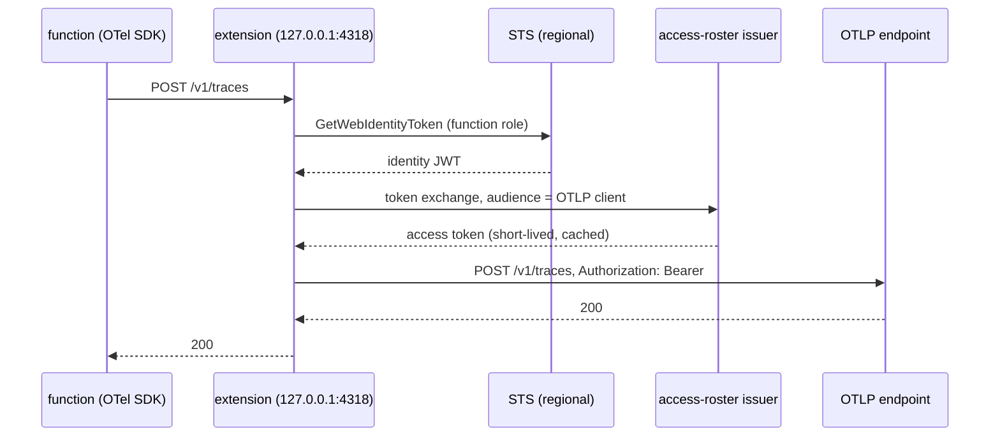

# AWS Lambda — telemetry with the function role's identity

A Lambda function can send its OpenTelemetry data to an OTLP endpoint that
trusts access-roster **without holding any secret**. The release carries an
extension layer, `access-roster-lambda-layer_<version>_linux_<arch>.zip`,
that does three things for the function:

1. asks STS for an identity token for the role the function already runs as
   (`sts:GetWebIdentityToken`, AWS outbound identity federation);
2. trades it at the access-roster issuer (RFC 8693 token exchange) for a
   short-lived access token audienced at the OTLP endpoint;
3. runs an OTLP/HTTP proxy on `127.0.0.1:4318` that forwards every export to
   the endpoint with that token as the bearer.

The function's own OpenTelemetry SDK needs no credential and no auth
configuration. It exports to the loopback address, with any language's
standard OTLP/HTTP exporter:

```
OTEL_EXPORTER_OTLP_ENDPOINT=http://127.0.0.1:4318
OTEL_EXPORTER_OTLP_PROTOCOL=http/protobuf   # or http/json
```

gRPC OTLP is not supported (HTTP protobuf and JSON only).



## Why a proxy, and why on demand

A Lambda execution environment is **frozen between invocations**: no timer
runs while it is frozen, so a token refreshed by a background loop can be
expired when the environment thaws and the function exports. The extension
therefore checks the clock on every export: a token is cached until a third
of its life remains, and a caller that finds it inside that window waits for
a new one (concurrent callers share one refresh). The extension also warms
the token on each `INVOKE`, so the usual export finds a fresh one waiting.

Forwarding is **synchronous**. Answering the exporter early and forwarding
later would let the environment freeze with the export still in memory.

## What the extension does when something is wrong

It is **fail-open**: telemetry never blocks, slows or crashes an invocation.

- No token (STS refused, the issuer is down or refuses the role): the proxy
  answers `503` with `Retry-After`, which OTLP exporters treat as retryable,
  and the extension logs **one line per failure window** (and one when it
  recovers). After a failure it does not call STS again for 5 seconds, so an
  exporter's retries are not a request storm. A token that is still valid is
  used even if its replacement failed.
- Missing or invalid configuration, or the port is taken: one log line, and
  the extension keeps answering the platform (an extension that exits is
  reported by Lambda as a crash of the invocation). Exports then find nothing
  listening.
- The upstream answers `401`: the cached token is dropped and the next export
  obtains a new one. Other upstream statuses are relayed unchanged.
- `SHUTDOWN`: the proxy stops accepting, lets in-flight forwards finish within
  the shutdown deadline, and exits.

Tokens are held in memory only (plus the optional file below) and are never
logged.

## Configuration

All settings are environment variables on the function.

| Variable | Default | Meaning |
|---|---|---|
| `ACCESS_ROSTER_ISSUER` | required | The issuer's base URL. |
| `ACCESS_ROSTER_AUDIENCE` | required | The audience asked of STS for the identity token. What the issuer's AWS verifier expects; the role policy pins it (below). |
| `ACCESS_ROSTER_OTLP_ENDPOINT` | required | The OTLP/HTTP base URL, `https`. The extension appends `/v1/traces`, `/v1/metrics`, `/v1/logs`. Plain `http` is accepted only for a loopback host. |
| `ACCESS_ROSTER_OTLP_AUDIENCE` | `otlp` | The exchange's audience and client id: the roster client that the OTLP endpoint accepts. |
| `ACCESS_ROSTER_LISTEN` | `127.0.0.1:4318` | The proxy's address. |
| `ACCESS_ROSTER_STS_DURATION_SECONDS` | `300` | Lifetime asked of the STS token (60 to 3600). It is used once, for the exchange. |
| `ACCESS_ROSTER_STS_ALGORITHM` | `ES384` | Signing algorithm asked of STS (`ES384` or `RS256`). |
| `ACCESS_ROSTER_TOKEN_FILE` | unset | If set, each access token is also written here (mode 0600, replaced atomically; the directory is created 0700). For a function that runs its own collector with a bearer-token-from-file extension. Off by default. Use a path under `/tmp`. |

STS needs a **regional** endpoint (the global one does not support the
call): the SDK picks it from `AWS_REGION`, which Lambda sets. The extension
needs egress to the regional STS endpoint, the issuer and the OTLP endpoint;
a VPC function without a NAT needs an STS interface endpoint.

## IAM and account setup

1. **The account must have outbound identity federation enabled** (IAM
   account settings, or `aws iam enable-outbound-web-identity-federation`).
   Without it STS answers `OutboundWebIdentityFederationDisabled`, which the
   extension logs.
2. **The function role** needs `sts:GetWebIdentityToken`, and the policy
   should pin the audience (and, optionally, the lifetime and algorithm):

```json
{
  "Effect": "Allow",
  "Action": "sts:GetWebIdentityToken",
  "Resource": "*",
  "Condition": {
    "StringEquals": {
      "sts:IdentityTokenAudience": "https://access.example",
      "sts:SigningAlgorithm": "ES384"
    },
    "NumericLessThanEquals": { "sts:DurationSeconds": "300" }
  }
}
```

3. **The roster** must admit the role: the issuer-side AWS verifier recognises
   the account, and a group matcher selects the role, for example
   `arn:aws:iam::111122223333:role/billing-*`. A role in no group is refused
   at the exchange, which shows up as a `503` plus the issuer's sentence in
   the extension's log line.

## Attaching the layer

Each release carries one zip per architecture:

| Lambda architecture | Release asset |
|---|---|
| `x86_64` | `access-roster-lambda-layer_<version>_linux_amd64.zip` |
| `arm64` | `access-roster-lambda-layer_<version>_linux_arm64.zip` |

The zip root is the layer root: it holds one file,
`extensions/access-roster-otlp` (mode 0755). Publish it as a layer version in
your own account and region, with the matching `--compatible-architectures`,
and add it to the function:

```
aws lambda publish-layer-version --layer-name access-roster-otlp \
  --zip-file fileb://access-roster-lambda-layer_<version>_linux_arm64.zip \
  --compatible-architectures arm64
```

The release does not publish a layer version for you. The binary is a static
Go executable with no runtime dependency, so it works with every runtime,
including container-image functions (copy it to `/opt/extensions/`).

## Size and cold start

| | amd64 | arm64 |
|---|---|---|
| binary (stripped, `-trimpath`) | 9.99 MB | 9.24 MB |
| zip | 4.05 MB | 3.67 MB |

In the Lambda Runtime Interface Emulator the extension registers and init
completes in about 12 ms (the first token is fetched in the background,
after registering, so it does not delay init). Lambda bills extension time
like function time; the proxy is idle between exports.

## Tests

`internal/lambdaext` has unit tests (token cache, expiry after a freeze,
single flight, failure backoff, STS and exchange against fakes, proxy
headers/body/encoding, 503 and refusals) and end-to-end tests that run the
real binary against a fake Extensions API, STS, issuer and OTLP upstream. One
more test runs it in the real Lambda base image with `aws-lambda-rie`; it is
opt-in (`ACCESS_ROSTER_RIE=1`, needs docker and port 8080).

Not covered by the layer: Lambda platform logs (the function sends its own
OTLP logs) and gRPC OTLP.
